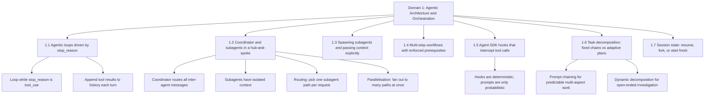

---
tags:
  - ccaf
  - domain/agentic-architecture
  - orchestration
  - agents
domain: 1
weight: 27
flashcards_min: 16
---

# 1 - Agentic Architecture & Orchestration

This is the heaviest domain on the exam — 27% of your score — and the one
passers report being hardest. It is about how you get Claude to do work that
takes more than one request: running an [[Glossary#Agentic loop|agentic loop]], splitting a
job across several agents, and keeping those agents coordinated, compliant, and
recoverable. Most questions here describe a symptom ("the loop never stops," "the
synthesis agent has no idea what search found") and ask you to pick the mechanism
that actually fixes it. Study the mechanism, not the vocabulary.

The domain has seven tasks. This note is organised around them.

## 1.1 Design and implement agentic loops for autonomous task execution

An [[Glossary#Agentic loop|agentic loop]] is the engine underneath every agent. You give
Claude a goal and some [[Glossary#Tool|tools]], then repeat a
cycle: send the request, look at what Claude asked for, run any tools it
requested, hand the results back, and send again. Claude decides what to do next;
you just execute and report.

The loop is controlled entirely by one field on the response: **`stop_reason`**.
When Claude wants to run a tool, `stop_reason` comes back as **`tool_use`**. When
Claude is finished and has a final answer for the user, it comes back as
**`end_turn`**. So the whole loop is: keep going while `stop_reason` is
`tool_use`, and stop the moment it is anything else. In code this is literally a
`while True` that breaks when `response.stop_reason != "tool_use"`.

Each turn you must **append the tool results to the conversation history** before
the next request. Claude does not remember anything between API calls — you
resend the full history every time. A tool result goes back inside a *user*
message as a `tool_result` block. That block carries three things: the
`tool_use_id` that matches the request it answers, the tool's output serialised
as a string, and an `is_error` flag. Matching the id matters when Claude requests
several tools at once, because the results can come back in any order and Claude
needs to know which answer belongs to which request. Feeding results back in is
what lets new information enter Claude's reasoning for the next step.

The power of the loop is that decisions are **model-driven**, not scripted. You
do not write a decision tree that says "first call `get_time`, then call
`add_duration`" You give Claude abstract, combinable tools and let it chain them.
Asked "what's the time," Claude calls one tool; asked "what day is it in 11
days," it chains a datetime lookup into a duration-adder; asked to set a reminder
next week, it uses all three in sequence. Claude will even pause to ask you for
missing information (like a purchase date it needs before computing a warranty
expiry) rather than guessing. **Abstract tools** beat hyper-specialised ones for the
same reason Claude Code ships `bash`, `read`, `edit`, and `grep` instead of a
"refactor code" tool — the model composes primitives into behaviours you never
explicitly programmed.

For the loop to work, Claude has to be able to **inspect its environment** —
observe the result of each action. Claude operates blind otherwise. This is why
computer use returns a screenshot after every click, and why the reliable file
pattern is *read before write*: Claude reads a file's current contents before
editing it. When you design an agent, always ask "how will Claude know if this
action worked?" and give it a way to see.

> The one legitimate use of a `stop_reason` other than `tool_use`/`end_turn`:
> `max_tokens` means the output was cut off, and `stop_sequence` means Claude hit
> a stop string you supplied.

## 1.2 Orchestrate multi-agent systems with coordinator-subagent patterns

When a task is too big for one agent, you split it across several. The standard
shape is **hub-and-spoke**: one [[Glossary#Coordinator|coordinator]] agent at the hub and
several [[Glossary#Subagent|subagents]] on the spokes. The rule that defines the pattern
is that **all communication flows through the coordinator**. Subagents do not
talk to each other directly. The coordinator handles routing, error handling,
and every handoff. You route everything through the hub on purpose — it gives you
one place to observe what is happening, one place to handle errors consistently,
and control over what information moves where.

The coordinator's job is **decomposition, delegation, and aggregation**: break
the request into pieces, decide which subagents to invoke, and merge their
results into one answer.

**Routing** is the name for that selection step: instead of always running the
same fixed pipeline, the coordinator looks at what the query actually needs and
sends it only to the relevant subagents. A support coordinator that gets "what
are your hours?" should not spin up a billing subagent and a refunds subagent
just because a full-pipeline run always includes them — it should recognise the
query as a simple lookup and route it to a single FAQ subagent, or answer it
directly. Routing is what keeps a multi-agent system from paying the latency and
token cost of every subagent on every request. See [[Glossary#Routing|Routing]].

The single most tested fact about subagents: **each subagent has isolated
context.** A subagent does *not* automatically inherit the coordinator's
conversation history. It starts fresh and knows only what you put in its prompt.
Everything downstream in this domain follows from that one fact.

When you partition the work, give each subagent a **distinct slice** — different
subtopics or different source types — so they do not duplicate each other's
effort. Watch the opposite failure too: if you decompose a broad research topic
too narrowly, the union of the pieces may miss whole areas, leaving gaps. The fix
is an **iterative refinement loop**: after synthesis, evaluate the combined
output for gaps, send targeted follow-up queries to fill them, and re-run
synthesis until coverage is good enough. This is the [[Glossary#Evaluator-optimizer|evaluator-optimizer]]
pattern (a producer creates output, a grader checks it, feedback loops back until
the grader is satisfied) applied at the system level.

**Parallelisation** is the sibling technique: instead of one agent juggling many
criteria in a single pass, fan the same input out to several specialised
evaluations at once and aggregate the results. For example, reviewing a pull
request for security issues, style violations, and test coverage as one
combined prompt tends to shortchange whichever concern comes last; running
three subagents in parallel — one per concern, each with its own tightly scoped
prompt — and then merging their findings gets deeper coverage on each axis. Each
parallel branch can have its own prompt and tools, so you get focused attention
per branch, independent optimisation, and easy scaling. This differs from
routing: routing *picks one* path for a request, parallelisation *fans out to
several* paths for the same request and combines what comes back. See
[[Glossary#Parallelisation|Parallelisation]]. 

Delegation — a core [[Glossary#AI fluency|AI fluency]] skill — is the mindset behind all of 
this: decide deliberately what you do yourself, what you do with AI, and what you 
hand to AI entirely, and distribute the work to each party's strengths.

## 1.3 Configure subagent invocation, context passing, and spawning

Spawning a subagent is done with the **[[Glossary#Task tool|Task tool]]**. For a
coordinator to be *able* to spawn subagents, its `allowedTools` must include
`Task`. If a coordinator is not delegating, the first thing to check is whether
`Task` is in its allowed tools at all.

Because subagents start with isolated context, you have to **pass context
explicitly in the prompt**. There is no shared memory between invocations and no
automatic inheritance. Concretely: if a synthesis subagent needs the search
results and document analysis that earlier agents produced, you paste those
complete findings *into the synthesis subagent's prompt*. If you forget, the
synthesis agent invents an answer from nothing.

Pass that context as **structured data that separates content from metadata** —
keep source URLs, document names, and page numbers attached to each finding — so
attribution survives the handoff between agents. Losing provenance during
handoffs is a recurring reliability failure (see [[5 - Context Management & Reliability]]).

Each subagent type is described by an **[[Glossary#AgentDefinition|AgentDefinition]]**: a
description, a system prompt, and a set of tool restrictions. Scope the tools to
the role. Write the coordinator's prompts to state the **research goals and
quality criteria**, not a rigid step-by-step procedure — goals let a subagent
adapt; scripts make it brittle.

One mechanical detail the exam likes: to run subagents **in parallel**, the
coordinator must emit **multiple `Task` calls in a single response**. Splitting
them across separate turns runs them one after another instead. Same idea as
requesting several tools in one assistant message.

## 1.4 Implement multi-step workflows with enforcement and handoff patterns

Some workflow steps must happen in order, every single time. The question is how
you *enforce* the ordering. You have two options, and the exam wants you to know
their difference in reliability. **Prompt-based guidance** — telling Claude in
the system prompt "always verify the customer before issuing a refund" — is only
*probabilistic*. It works most of the time, but it carries a non-zero failure
rate. **Programmatic enforcement** — a [[Glossary#Hook|hook]] or a prerequisite gate
in code — is *deterministic*. It cannot be talked out of.

So when deterministic compliance is genuinely required — identity verification
before a financial operation is the canonical example — you do not rely on the
prompt. You build a **prerequisite gate**: a piece of code, not a Claude
decision, that checks whether an earlier step already ran and refuses to let a
later one proceed if it did not. Concretely, a `PreToolUse` hook ([[#1.5 Apply Agent SDK hooks for tool call interception and data normalization|1.5]]) can look
at the conversation so far, and if `process_refund` is being called without a
prior successful `get_customer` call recorded, it returns `deny` — the tool call
never reaches your backend, no matter what Claude's reasoning was. The gate has
nothing to do with wording; it is a boolean check ("did step A already
succeed?") wired in front of step B.

A second example makes the shape clearer outside the refund case: in a CI/CD
pipeline, you gate `deploy_to_production` on `run_test_suite` having returned a
passing result — the deploy tool call is refused if no green test run is on
record for that commit, even if the agent's plan says "tests probably pass." A
third: an onboarding agent gates `provision_database_access` on
`verify_manager_approval` having returned an approval id — no approval id
recorded, no access granted, regardless of how convincingly the agent argues the
request is routine. In every case the gate holds an *identity or status token*
returned by step A and refuses to run step B without it.

For requests that raise several concerns at once, the pattern is to **decompose
into distinct items, investigate each in parallel with shared context, then
synthesise one unified resolution** — not several disconnected replies.

When a process must hand off to a human mid-stream (an escalation the agent
cannot resolve), send a **structured handoff summary**, because the human never
saw the transcript. Include the customer id, the root-cause analysis, the amount
in question, and the recommended action. A good handoff lets the human act
without re-doing the investigation. Escalation *triggers* — when to hand off at
all — belong to [[5 - Context Management & Reliability]].

## 1.5 Apply Agent SDK hooks for tool call interception and data normalization

A [[Glossary#Hook|hook]] is deterministic code that runs at a fixed point in the
agentic loop. A [[Glossary#CLAUDE.md|CLAUDE.md]] instruction is a *request*; a hook is a *guarantee*.
That contrast — hooks give deterministic guarantees, prompts give only
probabilistic compliance — is the heart of this task and reappears across the
domain.

Two hook events carry most of the weight:

- **[[Glossary#PreToolUse|PreToolUse]]** fires *before* a tool call and is the enforcement
  primitive — it is the only one that can stop an action before it happens. It
  returns a `permissionDecision` of `allow`, `deny`, or `ask` (hand it to the
  user). Use it to block a policy-violating action — say, a refund above a
  threshold — and redirect to an alternative workflow such as human escalation.
  It has a subtler move too: instead of blocking, return `updatedInput` to
  *rewrite* the call — for example, strip a secret out of a bash command and let
  the sanitised version run. Note that `updatedInput` replaces the whole input
  object, so echo back the fields you are not changing.
- **[[Glossary#PostToolUse|PostToolUse]]** fires *after* a tool call succeeds. Because the
  tool already ran, it is too late to stop the call — but it can transform the
  result before the model ever sees it. This is where **data normalisation**
  lives: when several MCP tools return dates in different shapes (a Unix
  timestamp from one, ISO 8601 from another, a numeric status code from a third),
  a PostToolUse hook rewrites them into one consistent format so the agent reasons
  over clean, uniform data.

The decision rule: **choose hooks over prompt-based enforcement whenever a
business rule requires guaranteed compliance.** If "usually" is not good enough,
it goes in a hook. (Hooks are also central to [[3 - Claude Code Configuration & Workflows]];
here the focus is using them to intercept tool traffic.)

## 1.6 Design task decomposition strategies for complex workflows

Breaking a big job into smaller ones comes in two flavours, and picking the wrong
one is a classic exam trap.

**Prompt chaining** is a *fixed sequential pipeline*: predetermined steps that
each build on the last, with optional non-LLM processing in between. You use it
when you can already picture the exact steps. Keeping Claude focused on one step
at a time produces better results than one giant prompt that juggles every
requirement — long prompts full of constraints tend to drop some. The worked
example is a large code review: analyse each file individually in its own local
pass, then run a *separate* cross-file integration pass. Splitting it this way
avoids **attention dilution**, where trying to hold the whole codebase in one
pass makes Claude miss things.

**Dynamic (adaptive) decomposition** generates its subtasks *from what it
discovers as it goes*. You use it for open-ended investigation where you cannot
plan the steps up front. The pattern is: map the structure first, identify the
high-impact areas, then build a prioritised plan that keeps adapting as
dependencies surface.

The choice is the skill: prompt chaining for predictable multi-aspect work,
dynamic decomposition for open-ended exploration. A related pattern is
[[#1.2 Orchestrate multi-agent systems with coordinator-subagent patterns|routing]]
([[#1.2 Orchestrate multi-agent systems with coordinator-subagent patterns|1.2]] above): categorise an incoming request first, then send it down one
specialised pipeline rather than a one-size-fits-all prompt. Chaining picks a
fixed *sequence* of steps; routing picks a *branch* based on what the request
is; [[#1.2 Orchestrate multi-agent systems with coordinator-subagent patterns|parallelisation]]
(also [[#1.2 Orchestrate multi-agent systems with coordinator-subagent patterns|1.2]]) runs several branches *at once* instead of choosing one.

The broader framing from the course is **workflows versus agents**. A workflow is
a predetermined series of Claude calls; an agent is a goal plus tools where
Claude figures out the steps. Choose based on how well you understand the task:
workflows when you can picture the exact flow, agents when you cannot predict the
task or its parameters. The default advice is to **prefer workflows wherever
possible and reach for agents only when the flexibility is truly required** —
workflows are more reliable and predictable, and users care about a product that
works, not about how clever the architecture is.

## 1.7 Manage session state, resumption, and forking

Long-running work spans multiple sittings, so you need to manage session state.

**Resuming** continues a specific prior conversation with **[`--resume <session-name>`](<Claude Commands.md#--resume>)**
(or by capturing a session id from earlier JSON output and passing it back). One
script can start the work and another resume it later with full context — handy
when a first pass produces a plan and a second pass carries it out.

**[[Glossary#fork_session|fork_session]]** creates an *independent branch* from a shared
baseline so you can explore divergent approaches without them interfering — for
example, comparing two refactoring or testing strategies that both start from the
same analysis you have already done. Forking is for parallel *what-ifs* from one
common starting point.

The judgement call the exam tests is **resume versus start fresh**. Resume when
the prior context is *mostly still valid*. Start a **new session seeded with a
structured summary** when the prior tool results have gone *stale* — a fresh
session with an injected summary is more reliable than resuming on top of stale
data. And when you resume after files have changed, **tell the agent exactly
which files changed** so it re-analyses those targeted spots instead of trusting
its now-outdated picture (or re-exploring everything from scratch).

Claude Code gives you related steering tools for the same problem.
**[`/compact`](<Claude Commands.md#/compact>)** summarises the conversation, makes that summary the new context, and drops the old messages to free the context window — but add instructions after the command (`/compact Focus on the --version flag work`) so it keeps what matters, or it may drift. **Rewind** (double-tap escape) rolls back to a checkpoint — code,
conversation, or both — and can *summarise from* or *up to* a checkpoint to
compress a side conversation or a long setup phase while keeping the rest.

## Traps & distractors

These are the wrong-but-plausible answers this domain engineers. Each is a
mistake a real engineer might actually make, so eliminate them by reasoning about
the mechanism.

- **Parsing natural-language signals to end the loop.** Watching Claude's prose
  for "done" or "complete" is unreliable — wording varies. The loop must be
  driven by the structured `stop_reason` field (`tool_use` to continue,
  `end_turn` to stop).

- **Checking assistant text content as a completion indicator.** Same family as
  above: the presence or content of a text block does not tell you the agent is
  finished. Only `stop_reason` does.

- **Using an arbitrary iteration cap as the *primary* stopping mechanism.** A
  hard "stop after N loops" is a legitimate *backstop* against runaway loops, but
  it is the wrong primary stop condition. The primary mechanism is still
  `stop_reason == end_turn`. An answer that presents a max-iteration counter as
  *the* way to terminate is a distractor.

- **Relying on a prompt instruction where deterministic compliance is
  required.** "Always verify identity before refunding" in the system prompt is
  probabilistic and carries a non-zero failure rate. When the rule must hold
  every time, the correct answer is a programmatic gate or a hook, not better
  prompt wording.

- **Assuming subagents inherit the coordinator's context.** They do not. Any
  answer that expects a subagent to "just know" prior findings without them being
  placed in its prompt is wrong — context must be passed explicitly.

- **Decomposing a broad topic too narrowly.** Splitting into tiny pieces feels
  thorough but can leave gaps between them, so a broad research task ends up with
  incomplete coverage. The mitigation is an iterative refinement loop, not finer
  slicing.

- **Forgetting `Task` in `allowedTools`, or handing a subagent context it never
  received ([[#1.3 Configure subagent invocation, context passing, and spawning|1.3]]).** A coordinator can only spawn subagents if its `allowedTools`
  includes `Task`; if it is not delegating, check that first. And because
  subagents start with isolated context, any answer that expects one to "just
  know" prior findings — without those findings being placed in its prompt as
  structured data with attribution intact — is wrong. There is no shared memory
  and no automatic inheritance.

- **Using PostToolUse to block a policy-violating action ([[#1.5 Apply Agent SDK hooks for tool call interception and data normalization|1.5]]).** PostToolUse
  fires *after* the tool has already run, so it is too late to stop anything — it
  can only transform the result (data normalisation). The only event that can
  stop an action before it happens is PreToolUse, which returns a
  `permissionDecision` of `allow`, `deny`, or `ask`. Picking PostToolUse for
  enforcement is a distractor that swaps the two events.

- **Reaching for adaptive decomposition — or one giant prompt — when the steps
  are already predictable ([[#1.6 Design task decomposition strategies for complex workflows|1.6]]).** When you can picture the exact steps, prompt
  chaining (a fixed sequential pipeline) is the fit; adaptive decomposition is
  for open-ended investigation you cannot plan up front. Cramming every
  requirement into a single mega-prompt is also wrong, because attention dilution
  makes Claude drop constraints — split the work into focused passes instead.

- **Resuming on top of stale tool results instead of starting fresh ([[#1.7 Manage session state, resumption, and forking|1.7]]).** When
  the prior tool results have gone stale, resuming the old session is *less*
  reliable than starting a new session seeded with a structured summary. Resume
  only when the prior context is mostly still valid, and when you do resume after
  files changed, tell the agent exactly which files changed. Note too that
  `fork_session` is for exploring divergent *what-ifs* from a shared baseline, not
  for continuing one line of work — that is what `--resume` is for.

## Flashcards

Question
Your agent's loop never terminates — it keeps calling tools forever. You are ending the loop by scanning Claude's text output for phrases like "I'm done" or "task complete." What is the correct fix?
?
Stop parsing natural-language signals entirely. Drive the loop off the `stop_reason` field: continue while `stop_reason == "tool_use"` and break as soon as it is `end_turn`. The stop condition is a structured field, not the wording of Claude's prose.
#flashcards/domain-1
<!--SR:!2026-09-09,4,270-->

Question
Between iterations of an agentic loop, what must you do with each tool's output, and where exactly does it go?
?
Append the output to the conversation history so it enters Claude's reasoning on the next turn. It goes inside a *user* message as a `tool_result` block whose `tool_use_id` matches the originating request. Claude keeps no memory between calls, so you resend the full history each time.
#flashcards/domain-1
<!--SR:!2026-09-06,1,230-->

Question
A coordinator delegates a synthesis step to a subagent, but the synthesis agent behaves as if it never saw the earlier search results and document analysis. What is the underlying cause and the fix?
?
Subagents run with isolated context and do not inherit the coordinator's conversation history. The fix is to pass the complete prior findings explicitly in the synthesis subagent's prompt — there is no shared memory or automatic inheritance.
#flashcards/domain-1
<!--SR:!2026-09-09,4,270-->

Question
You want three subagents to run in parallel from the coordinator, but they keep executing one after another. What is wrong?
?
The coordinator is emitting the `Task` calls across separate turns. To run subagents in parallel, it must emit multiple `Task` calls in a single response. (Also confirm `Task` is in the coordinator's `allowedTools`, or it cannot spawn subagents at all.)
#flashcards/domain-1
<!--SR:!2026-09-08,3,250-->

Question
A refund agent must verify the customer's identity before issuing any refund, and the business needs this to be guaranteed, not usually-correct. Why is a system-prompt instruction insufficient, and what do you build instead?
?
Prompt instructions are only probabilistic — they carry a non-zero failure rate. For deterministic compliance, build a programmatic prerequisite gate that blocks `process_refund` from running until `get_customer` has returned a verified id. Code enforces it every time.
#flashcards/domain-1
<!--SR:!2026-09-08,3,250-->

Question
Several MCP tools return timestamps in different formats — one Unix epoch, one ISO 8601, one a numeric status code — and the agent keeps mishandling them. Which hook event solves this and how?
?
A PostToolUse hook. It fires after each tool call succeeds and can transform the result before the model sees it, normalising all the formats into one consistent shape so the agent reasons over clean data.
#flashcards/domain-1
<!--SR:!2026-09-08,3,250-->

Question
You need to block a refund above a policy threshold *before* it executes and route the case to a human. Which hook event, and what values can it return?
?
A PreToolUse hook — the only event that can stop an action before it happens. It returns a `permissionDecision` of `allow`, `deny`, or `ask`. To sanitise rather than block (e.g. strip a secret from a command), it can instead return `updatedInput` to rewrite the call.
#flashcards/domain-1
<!--SR:!2026-09-06,1,230-->

Question
You are choosing a decomposition strategy for a large multi-file code review with well-understood aspects. Prompt chaining or dynamic decomposition — and how do you split it?
?
Prompt chaining, because the steps are predictable. Analyse each file in its own local pass, then run a separate cross-file integration pass. Splitting it this way avoids attention dilution from trying to hold the whole codebase in one pass.
#flashcards/domain-1
<!--SR:!2026-09-06,1,230-->

Question
The task is an open-ended investigation where you cannot plan the steps in advance. Which decomposition approach fits, and what is its shape?
?
Dynamic (adaptive) decomposition, which generates subtasks from what each step discovers. Map the structure first, identify the high-impact areas, then build a prioritised plan that keeps adapting as dependencies surface.
#flashcards/domain-1
<!--SR:!2026-09-05,0,230-->

Question
You broke a broad research topic into very narrow subagent tasks, and the final report has whole areas missing. What went wrong and how do you recover coverage?
?
Overly narrow decomposition left gaps between the pieces. Use an iterative refinement loop: evaluate the synthesised output for gaps, send targeted follow-up queries to fill them, and re-run synthesis until coverage is sufficient.
#flashcards/domain-1
<!--SR:!2026-09-06,1,230-->

Question
You resumed a session to keep working on a codebase, but the files were modified since the last session and Claude gives stale, inconsistent answers. What are your two options and how do you choose?
?
Either resume and explicitly tell the agent which files changed so it re-analyses just those spots, or — if the prior tool results are broadly stale — start a fresh session seeded with a structured summary, which is more reliable than resuming on top of stale data.
#flashcards/domain-1
<!--SR:!2026-09-08,3,250-->

Question
You want to compare two refactoring strategies that both start from the same analysis you have already completed, without the branches interfering. What mechanism fits?
?
`fork_session`: it creates an independent branch from a shared baseline so you can explore divergent approaches in parallel from one common starting point.
#flashcards/domain-1
<!--SR:!2026-09-08,3,250-->

Question
When should you build an agent (goal plus tools, Claude figures out the steps) rather than a workflow (a predetermined series of calls)?
?
Use a workflow when you can picture the exact steps or your UX constrains users to fixed tasks; use an agent only when you cannot predict the task or its parameters. Default to workflows for reliability and reach for agents only when the flexibility is truly required.
#flashcards/domain-1
<!--SR:!2026-09-08,3,250-->

Question
Why must an agent be able to inspect its environment, and what file-editing habit follows from it?
?
Claude acts blind and cannot tell whether an action succeeded without observing the result — this is why computer use returns a screenshot after each action. The habit is *read before write*: read a file's current contents before editing it.
#flashcards/domain-1
<!--SR:!2026-09-08,3,250-->

Question
Your coordinator pushes every incoming request through all of its subagents, even trivial ones, which wastes time and tokens. What does a well-designed coordinator do instead?
?
It analyses what the query actually needs and dynamically selects only the relevant subagents, rather than always routing through the full pipeline. Decomposition, delegation, and subagent selection should scale to the complexity of the request.
#flashcards/domain-1
<!--SR:!2026-09-08,3,250-->

Question
A synthesis subagent returns a polished report, but every claim has lost track of which document it came from, so you can no longer verify attribution. How should the coordinator have passed the upstream findings?
?
As structured data that separates content from metadata — keeping source URLs, document names, and page numbers attached to each finding — so provenance survives the handoff. Passing findings as raw prose loses attribution between agents.
#flashcards/domain-1
<!--SR:!2026-09-08,3,250-->

Question
An agent hits a case it cannot resolve and must escalate to a human who never saw the conversation. What should it send, and why is dumping the raw transcript the wrong move?
?
Send a structured handoff summary — the customer id, the root-cause analysis, the amount in question, and the recommended action — so the human can act without redoing the investigation. Because the human never saw the transcript, an unstructured dump forces them to re-derive everything from scratch.
#flashcards/domain-1
