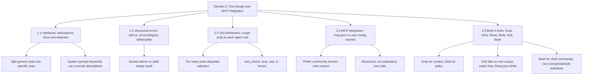

---
tags:
  - ccaf
  - domain-2
  - tool-design
  - mcp
domain: 2
weight: 18
flashcards_min: 16
---

# 2 - Tool Design & MCP Integration

This domain is worth 18% of the exam and is one of the two highest-failure
areas, so it rewards careful study. The through-line is simple: an agent is only
as good as the tools you give it and the words you use to describe them. Most of
the wrong answers here describe tools that *work* in isolation but that the model
cannot reliably *choose*, *route to*, or *recover from*. Everything below is
about making tool use predictable.

A quick vocabulary anchor before the tasks. A [[Glossary#Tool|tool]] is a function you expose
to the model so it can act on the outside world, described to the model by a
[[Glossary#Tool schema|tool schema]] — a name, a description, and a [[Glossary#JSON Schema|JSON Schema]] for its inputs. The **Model Context Protocol** ([[Glossary#MCP (Model Context Protocol)|MCP]]) is a standard way to package tools, data, and prompt
templates in a reusable server that any MCP-aware client — Claude Code, the
desktop app, or your own script — can connect to. This domain leans on the [[Glossary#Agentic loop|agentic loop]] from [[1 - Agentic Architecture & Orchestration|1 - Agentic Architecture & Orchestration]] and feeds the reliability patterns in [[5 - Context Management & Reliability|5 - Context Management & Reliability]].

---

## How tool use actually works (the shared mechanism)

Every request needs three fields regardless of tools: **`model`**,
**`messages`** (a list where each entry has a `role` of `user` or `assistant`
plus content), and **`max_tokens`**, a required cap on how much Claude may
generate in that one reply. `max_tokens` is easy to confuse with
[[Glossary#Context window|context-window]] capacity, but it only bounds this
response's length — it says nothing about how much history or tool output the
request can carry. See [[Glossary#max_tokens|max_tokens]] and
[[5 - Context Management & Reliability|5 - Context Management & Reliability]].

This entire area is built around a single core loop, so let's start by
understanding that loop. On top of those three fields, you send Claude a
request with a list of tool schemas. Claude replies with a message made of
[[Glossary#Content block|content blocks]]: a text block
explaining its thinking, and one or more **tool_use** blocks naming a tool and
the input it wants. You detect this by reading the response's
[[Glossary#stop_reason|stop_reason]]: when it equals `"tool_use"`, Claude is asking you to run
something. You execute the tool, then send the result back inside a user message
as a **tool_result** block whose `tool_use_id` matches the request. The loop
repeats until `stop_reason` is `"end_turn"`. This is the same loop that
[[1 - Agentic Architecture & Orchestration|1 - Agentic Architecture & Orchestration]] uses for autonomy.

Two mechanical details the exam expects you to know. Claude does not store the
conversation for you, so you must append every block — including the full
`tool_use` blocks — back into the message history yourself, or Claude loses
track of what it asked. And Claude can emit several `tool_use` blocks in one
response, each with its own `id`; you match every result to its request by
`tool_use_id`, and the order does not have to be preserved.

A tool result block carries an **`is_error`** flag. Setting it tells Claude the
tool failed rather than returned data — this is the API-level seed of the
structured-error idea that [[#Task 2.2 — Structured error responses for MCP tools|Task 2.2]] develops for MCP.

---

## Task 2.1 — Design tool interfaces with clear descriptions and boundaries

The single most important idea in this domain: **the tool description is the
primary thing the model uses to decide which tool to call.** The name and
description are not documentation for you — they are the model's decision
criteria. A thin description ("Saves an article") gives the model almost nothing
to reason with, and selection becomes unreliable the moment two tools look even
slightly similar.

A good description does more than say what the tool does. It states the input
formats, gives an example query or two, spells out edge cases, and explains the
boundary — when to use *this* tool versus a similar one. The course's own
`edit_document` tool is a small model of this: its parameter description says the
text to replace "must match exactly, including whitespace," which is precisely
the boundary detail that stops the model from misusing it. In the SDK, each
parameter gets its own description (via a Pydantic `Field`), and those become the
JSON Schema the model reads, so an opaque parameter like `doc_id` becomes
self-explanatory.

The classic failure is **overlapping descriptions causing misrouting**. If you
have `analyze_content` and `analyze_document` with near-identical descriptions,
the model cannot tell them apart and routes requests to the wrong one. The fix
is not a longer system prompt — it is to rename and re-scope. Turn
`analyze_content` into `extract_web_results` with a web-specific description so
its purpose no longer overlaps.

The same instinct fixes an over-generic tool: split it into purpose-specific
tools with defined input/output contracts. A vague `analyze_document` becomes
`extract_data_points`, `summarize_content`, and `verify_claim_against_source` —
each with one clear job the model can select confidently.

One subtlety that trips people up: **the system prompt can override even a
well-written tool description.** Keyword-sensitive wording in the system prompt
can create unintended associations — if the prompt keeps saying "search," the
model may reach for a search tool when another was the right call. So when tool
selection misbehaves, review the system prompt for stray keywords as well as the
tool descriptions.

### Built-in server-side tools follow the same shape

Some tools are built into the API — you enable them with a small typed schema
instead of writing your own. They still participate in the same tool_use loop.

- The **text editor tool** lets Claude view, create, replace, and insert text in
  files, and undo edits. Its schema is versioned and tied to the model — for
  example `text_editor_20250728` — but you still supply the code that performs
  the file operations; Claude only decides what to ask for.
- The **web search tool** (`web_search_20250305`) runs the search for you
  entirely; you just enable it and can cap it with `max_uses` and restrict it
  with `allowed_domains`. Its results come back with citations attached.
- The **code execution tool** (`code_execution_20250825`) runs Python in a
  sandboxed container, which is ideal for data analysis. Each execution starts
  from a clean slate, so the model must re-import libraries and re-declare
  variables every time.
- **Computer use** hands Claude a virtual desktop through a deliberately tiny
  schema (`computer_20250124` with a display size); behind the scenes it expands
  into mouse/keyboard/screenshot actions, and you supply the environment (for
  example a Docker container). It is the same tool_use flow, not a special mode.

---

## Task 2.2 — Structured error responses for MCP tools

When an MCP tool fails, *how* you report the failure decides whether the agent
can recover. MCP signals a failure with the **`isError`** flag, but the flag
alone is not enough — the agent needs metadata to choose between retrying,
explaining the problem to the user, or escalating.

The named anti-pattern is a **uniform generic error** like "Operation failed."
It strips the agent of any basis for a recovery decision, so the agent either
gives up or retries blindly. The exam treats this as a primary wrong answer.

Instead, return an **error taxonomy** the agent can act on:

- **transient** — timeouts, service unavailable; usually worth retrying.
- **validation** — the input was malformed; retrying the same input will not
  help, but fixing the input might.
- **business** — a policy violation (for example a refund above a threshold);
  retrying never helps, and the agent should explain the rule to the user.
- **permission** — the caller is not allowed to do this.

Alongside the category, include an **`isRetryable`** boolean so the agent does
not burn attempts on something that can never succeed, and a human-readable
description it can relay to a user. For business-rule violations specifically,
mark `retriable: false` and phrase the description in customer-friendly terms.

One distinction the exam loves: an **access failure** (a timeout that needs a
retry decision) is not the same as a **valid empty result** (a query that
succeeded and simply found nothing). Reporting "no matches" as an error, or a
timeout as an empty result, both lead the agent to the wrong next step.

In a multi-agent system, errors should be handled at the lowest level that can
resolve them. A subagent should recover locally from transient failures and
propagate to the [[Glossary#Coordinator|coordinator]] only what it genuinely cannot resolve — and when it
does propagate, it should include what it attempted and any partial results, so
the coordinator can decide intelligently. This is the tool-side view of the
error-propagation patterns in
[[5 - Context Management & Reliability|5 - Context Management & Reliability]].

---

## Task 2.3 — Distribute tools across agents and configure tool choice

More tools is not better. **Too many tools degrades selection reliability**
because every added tool increases the model's decision complexity. The guide's
concrete framing is giving an agent 18 tools when 4–5 would do. The lesson is to
scope each agent's tool set to its role.

Agents also **misuse tools that fall outside their specialization**. A synthesis
agent handed a web-search tool will tend to run searches it should not, muddying
its actual job. The fix is scoped access: give each agent only the tools its role
needs, plus a small number of cross-role tools for genuine high-frequency needs.
For example, give a synthesis agent a narrow `verify_fact` tool for quick checks
while routing anything more complex back through the
[[Glossary#Coordinator|coordinator]].

You can also constrain tools by replacing a generic one with a safer, specific
alternative. Swap a wide-open `fetch_url` for a `load_document` tool that
validates document URLs, and the agent can no longer wander off to arbitrary
pages.

The other half of this task is [[Glossary#tool_choice|tool_choice]], which
controls whether and how the model must call a tool:

- **`auto`** — the model decides; it may return plain text instead of calling a
  tool. This is the default and suits open-ended conversation.
- **`any`** — the model must call *some* tool but chooses which. Use it to
  guarantee a tool call rather than a chatty text reply.
- **forced** — `{"type": "tool", "name": "..."}` makes the model call one named
  tool. Use it to guarantee a specific step runs first, for example
  `extract_metadata` before any enrichment tools, then handle the later steps in
  follow-up turns.

This overlaps with structured output in
[[4 - Prompt Engineering & Structured Output|4 - Prompt Engineering & Structured Output]], where `tool_choice` is
the mechanism for guaranteeing schema-compliant JSON.

---

## Task 2.4 — Integrate MCP servers into Claude Code and agent workflows

To use an outside integration in Claude Code, you register an MCP server. Where
you register it decides who gets it, and that scoping is exactly what the exam
asks about:

- **`.mcp.json` at the project root** is **project scope**. You commit it to the
  repository, so the whole team gets the same tooling. This is where shared team
  servers belong.
- **`~/.claude.json`** is **user scope**, personal to you and never shared with
  teammates. This is where personal or experimental servers belong.

A common exam-shaped scenario: a teammate is not getting an MCP server that
everyone else has. If it was configured in someone's `~/.claude.json`, it was
never shared — it needs to move to the project's `.mcp.json`. (This mirrors the
[[Glossary#CLAUDE.md|CLAUDE.md]] scoping trap in
[[3 - Claude Code Configuration & Workflows|3 - Claude Code Configuration & Workflows]].)

Credentials never get committed. `.mcp.json` supports **environment variable
expansion**, so you write `${GITHUB_TOKEN}` and the value resolves at load time,
keeping secrets out of version control.

Once servers are connected, **tools from all configured servers are discovered
at connection time and are available to the agent simultaneously.** Connecting
five servers means the model chooses among the union of their tools — which is
exactly why the description quality ([[#Task 2.1 — Design tool interfaces with clear descriptions and boundaries|2.1]]) and tool count ([[#Task 2.3 — Distribute tools across agents and configure tool choice|2.3]]) discipline
matters here too.

Mechanically, that discovery step is a specific message exchange: the client
sends a [[Glossary#ListToolsRequest / ListToolsResult|ListToolsRequest]] and the
server answers with a `ListToolsResult` listing what it offers, before your
application ever hands anything to Claude. Running a discovered tool is the
matching [[Glossary#CallToolRequest / CallToolResult|CallToolRequest/CallToolResult]]
exchange — the client asks the server to run one tool with specific arguments
and gets its output back. This exchange sits one layer outside the agentic
loop: your application's MCP client talks to the MCP server this way, and it is
your application — not Claude — that relays the discovered tools and their
results into the `tool_use`/`tool_result` loop described above.

A practical gotcha: **a thin MCP tool description loses to a built-in.** If your
MCP tool's description is vague, the model may prefer a built-in like `Grep`
even when the MCP tool is more capable. The fix is a better description, not a
prompt patch.

MCP servers expose three kinds of capability, distinguished by *who controls
them*, and this is the most exam-relevant idea in the protocol:

| Primitive | What it is | Controlled by |
|---|---|---|
| **Tools** | Functions the model calls to *do* something | the model |
| **Resources** | Read-only data the app pulls in as context | the application |
| **Prompts** | Pre-built instruction templates | the user |

The corollary that shows up on the exam: exposing data as a **resource** rather
than forcing the agent to discover it through tool calls reduces exploratory tool
traffic. Publish a content catalog — issue summaries, a documentation hierarchy,
a database schema — as a resource, and the agent sees what is available without
probing for it. Resources are addressed by URI and come in two flavours: a
[[Glossary#Direct resource|direct resource]] (a fixed URI like `docs://documents`)
and a [[Glossary#Resource template|resource template]] (a parameterized URI like
`docs://documents/{doc_id}` that answers a family of queries and supports
auto-completion).

Finally, a build-versus-adopt judgment: **prefer an existing community MCP
server** for standard integrations like Jira or GitHub, and reserve custom
servers for genuinely team-specific workflows. You get maintained, tested tools
for free. "Team-specific" includes business logic that must be enforced
*deterministically* — a topic-based subscriber filter before sending a
notification, say. A community server can do the generic action (send the
email), but the filtering rule itself belongs in code the server runs, not in
a system-prompt instruction layered on top of a generic tool. This is the
same choice [[1 - Agentic Architecture & Orchestration#1.4 Implement multi-step workflows with enforcement and handoff patterns|1.4's prerequisite gates]]
make: a prompt only gets the model to *usually* follow the rule, while code
enforces it *every time* — so a rule that must always hold belongs in the
server's code, not the prompt.

> [!note] 
> The course project uses the **stdio** transport, where the client launches the
> server as a local subprocess and they talk over standard input/output — which
> is why a Claude Code server entry is a *command plus arguments* rather than a
> URL. MCP is transport-agnostic and also supports HTTP-based transports for
> remote servers; the exam guide tasks focus on local stdio servers, so treat
> remote-transport specifics as background.

---

## Task 2.5 — Select and apply Claude Code's built-in tools

Claude Code ships with a core set of file and shell tools, and the exam tests
picking the right one for the job. The distinctions are small but exact:

- **Grep** searches file *contents* — function names, error message strings,
  import statements. Reach for it to find every caller of a function or locate
  where an error is raised.
- **Glob** matches file *paths* by name or extension pattern, such as
  `**/*.test.tsx` to find every test file regardless of directory.
- **Read** and **Write** handle whole files; **Edit** makes targeted changes by
  matching a unique piece of anchor text. When you already know every
  occurrence of a string in a file should change — renaming a variable used a
  dozen times, say — set **`replace_all: true`** on the first `Edit` call
  instead of reaching for `Bash` with `sed` or calling `Edit` once per
  occurrence; it is the purpose-built, single-call way to do a whole-file
  rename.
- **Bash** runs shell commands in the project environment — tests, git
  operations, builds, installs, one-off scripts — anything that isn't itself a
  file read, write, or search. It is not a substitute for the other five
  tools: the exam consistently marks `find`/`grep` piped through `Bash`, or a
  `sed` replacement, as the wrong choice whenever `Grep`, `Glob`, or `Edit`
  can do the same job. The dedicated tools are safer (no shell-escaping or
  regex-dialect surprises) and give Claude a structured result instead of raw
  text to re-parse, which is why they win even when the `Bash` equivalent
  would technically work.
- When **Edit fails because the anchor text is not unique**, the right first fallback is to **Read** the file, find enough surrounding context to make the string to be replaced unique, and retry **Edit** with that larger context — or set `replace_all: true` if every occurrence should change. **Read** + **Write** is a valid last resort, but only after a context-widened **Edit** retry has also failed. This is a frequently tested pairing.

> [!tip] 📌 Reported on the exam
> Current Claude Code documentation names widen-the-context or `replace_all` as
> the Edit tool's own recovery path for a non-unique match, and never mentions
> Read + Write at all. The certification exam guide's own answer key still
> names **Read + Write** as the correct fallback for this scenario — and
> flags the divergence itself. Answer **Read + Write** on the exam; use
> widen-context or `replace_all` in real Claude Code work.
> *Verified against the [tools reference](https://code.claude.com/docs/en/tools-reference) (checked 2026-09-12).*

The deeper skill is exploring a codebase *incrementally* instead of reading
everything at once. Grep to find the entry points, then Read to follow the
imports and trace the flow. To trace how a function is used across wrapper
modules, first identify all the exported names, then search each name across the
codebase. This keeps context focused, which ties directly into
[[5 - Context Management & Reliability|5 - Context Management & Reliability]].

---

## Traps & distractors

These are the wrong-but-plausible answers the guide explicitly names for this
domain. Each is a mistake a real engineer makes, so eliminating on
obvious-wrongness will not save you — reason about the mechanism.

- **Returning a generic "Operation failed" error.** It hides the error taxonomy,
  so the agent cannot tell a retryable timeout from a permanent policy
  violation, and it makes the wrong recovery choice. Always return
  `errorCategory` and `isRetryable`.
- **Two tools with near-identical descriptions** (for example `analyze_content`
  and `analyze_document`). The model cannot route between them, so it misroutes.
  Rename and re-scope rather than adding system-prompt hints.
- **Giving an agent 18 tools instead of 4–5.** More tools increases decision
  complexity and degrades selection reliability. Scope tools to each agent's
  role.
- **Handing an agent tools outside its specialization** (a synthesis agent with a
  web-search tool). It tends to misuse them. Restrict the tool set, and provide
  only narrow cross-role tools for high-frequency needs.
- **Fixing tool selection by editing the system prompt** when the real problem is
  a thin or overlapping tool description. Worse, keyword-sensitive system-prompt
  wording can *override* a good description and pull the model to the wrong tool.
- **Treating a valid empty result as an error** (or a timeout as "no results").
  An access failure needs a retry decision; a successful query with no matches
  does not. Conflating them sends the agent down the wrong path.
- **Committing credentials in `.mcp.json`.** Use `${ENV_VAR}` expansion instead;
  the value resolves at load time and never enters version control.
- **Putting shared team tooling in `~/.claude.json`.** That is user scope, so
  teammates never receive it. Shared servers belong in the project-level
  `.mcp.json`.
- **Leaving a capable MCP tool with a thin description.** The model will prefer a
  built-in like `Grep` over it. Enhance the description; do not patch around it.
- **Building a custom MCP server for a standard integration** like Jira when a
  maintained community server already exists. Reserve custom servers for
  team-specific workflows.
- **Giving up on `Edit` at the first non-unique-match failure.** `Edit` needs a
  single unique match, so a repeated snippet fails rather than risk changing the
  wrong spot. In real Claude Code work, widen the anchor with more surrounding
  context (or use `replace_all`) and retry `Edit` before falling back to Read +
  Write. On the certification exam itself, though, the guide's answer key wants
  Read + Write as the named fallback — see the callout in Task 2.5 above.
- **Using `Grep` to find files by name (or `Glob` to search inside them).** Grep
  searches file *contents* and Glob matches file *paths*; swapping them sends you
  looking for a filename in the wrong place. Match the tool to whether you are
  after text or a path.
- **Reaching for `Bash` (`find`, `grep`, `sed`) when a dedicated tool already
  does the job.** `Bash` piping `find`/`grep`, or a `sed` replacement, can
  technically work, but the exam marks it wrong whenever `Grep`, `Glob`, or
  `Edit` covers the same task — they are safer and give Claude structured
  results instead of raw text. `Bash` is for the things that genuinely aren't
  file reads, writes, or searches: running tests, git, builds, installs.

---

## Flashcards

Question
An agent has two tools, `analyze_content` and `analyze_document`, with nearly
identical descriptions, and it keeps calling the wrong one. What is the correct
fix, and what is the tempting wrong fix?
?
Correct fix: rename and re-scope the tools so their purposes no longer overlap
(for example `analyze_content` → `extract_web_results` with a web-specific
description). Tempting wrong fix: adding hints to the system prompt — the
description is the model's primary selection signal, and thin or overlapping
descriptions are the root cause.
#flashcards/domain-2
<!--SR:!2026-09-09,3,250-->

Question
An MCP tool hits a downstream timeout. You could return `{isError: true,
content: "Operation failed"}`. Why is that the wrong design, and what should you
return instead?
?
A generic error hides the error taxonomy, so the agent cannot decide whether to
retry, explain, or escalate. Return structured metadata: `errorCategory:
transient`, `isRetryable: true`, and a human-readable description — so the agent
knows a retry may succeed.
#flashcards/domain-2
<!--SR:!2026-09-09,3,250-->

Question
A customer requests a refund that exceeds the policy limit. How should the MCP
tool report this so the agent behaves correctly?
?
As a business-rule error: `errorCategory: business`, `retriable: false`, and a
customer-friendly description of the rule. `retriable: false` stops the agent
from wasting retries, and the readable description lets it explain the limit to
the customer.
#flashcards/domain-2
<!--SR:!2026-09-09,3,250-->

Question
A synthesis subagent keeps running web searches it should not. What is the
underlying cause and the fix?
?
Cause: it was given a tool outside its specialization, and agents tend to misuse
such tools. Fix: scope its tool set to its role. If it occasionally needs a
quick check, give it a narrow tool like `verify_fact` and route complex cases
through the coordinator.
#flashcards/domain-2
<!--SR:!2026-09-09,3,250-->

Question
You need to guarantee the model calls a tool rather than replying with
conversational text, but you do not care which tool. Which `tool_choice` setting?
?
`tool_choice: "any"` — the model must call some tool but chooses which. `auto`
would allow a plain-text reply; a forced `{"type":"tool","name":"..."}` would
lock it to one specific tool.
#flashcards/domain-2
<!--SR:!2026-09-09,3,250-->

Question
You must ensure `extract_metadata` runs before any enrichment tools. Which
`tool_choice` configuration achieves this, and how do the later steps happen?
?
Force the specific tool with `tool_choice: {"type": "tool", "name":
"extract_metadata"}`, then handle the enrichment steps in follow-up turns
(switching back to `auto` or `any`). Forcing guarantees the first step; you do
not chain further forced calls in the same turn.
#flashcards/domain-2
<!--SR:!2026-09-07,1,230-->

Question
A new teammate is missing an MCP server that everyone else has. Where was it
probably configured, and how do you fix it for the whole team?
?
It was likely configured in someone's user-scoped `~/.claude.json`, which is
personal and never shared. Move it to the project root `.mcp.json`, which is
committed and shared with the team.
#flashcards/domain-2
<!--SR:!2026-09-10,4,270-->

Question
How do you give an MCP server an auth token in `.mcp.json` without committing the
secret?
?
Use environment variable expansion — write `${GITHUB_TOKEN}` in the config and
let the value resolve at load time. The token stays out of version control.
#flashcards/domain-2
<!--SR:!2026-09-09,3,250-->

Question
Claude Code keeps preferring the built-in `Grep` tool over a more capable MCP
tool that does the same job better. What is the fix?
?
Improve the MCP tool's description so it clearly details its capabilities and
outputs. A thin description loses to built-ins; the fix is a better description,
not a system-prompt workaround.
#flashcards/domain-2
<!--SR:!2026-09-09,3,250-->

Question
An agent wastes tool calls exploring what data is available before it can answer.
What MCP feature reduces this, and why?
?
Expose the data catalog as an MCP **resource** (issue summaries, doc hierarchy,
database schema). Resources are application-controlled context the agent can see
without probing, cutting exploratory tool calls. Tools are for actions;
resources are for context.
#flashcards/domain-2
<!--SR:!2026-09-09,3,250-->

Question
`Edit` fails on a file because the anchor text you targeted appears more than
once. What is the reliable fallback?
?
Read the full file, then Write it back with your change. Edit needs a unique text
match; when it cannot find one, Read + Write is the dependable path.
#flashcards/domain-2
<!--SR:!2026-09-09,3,250-->

Question
You need to find every place a function is called across a codebase, then follow
its data flow. Which built-in tools do you use, in what order, and why not just
read everything?
?
Use Grep to search file contents for the function name and find all callers, then
Read those files to follow imports and trace the flow. Reading everything upfront
floods the context; incremental Grep-then-Read keeps context focused.
#flashcards/domain-2
<!--SR:!2026-09-09,3,250-->

Question
In the agentic loop, how do you know Claude is asking to run a tool, and how do
you return the result correctly when Claude requested several tools at once?
?
Check `stop_reason == "tool_use"`. For each `tool_use` block, run the tool and
return a `tool_result` block whose `tool_use_id` matches that request. Order need
not be preserved — the IDs do the matching — and you must append the assistant's
`tool_use` blocks to history yourself.
#flashcards/domain-2
<!--SR:!2026-09-09,3,250-->

Question
When should you choose an existing community MCP server versus building a custom
one?
?
Use a community server for standard integrations (Jira, GitHub) — they are
maintained and tested. Reserve custom servers for genuinely team-specific
workflows that no existing server covers.
#flashcards/domain-2
<!--SR:!2026-09-09,3,250-->

Question
You have one `analyze_document` tool, and the model uses it inconsistently —
sometimes to pull out data points, sometimes to summarize, sometimes to
fact-check. What is the design fix, and why is a longer description not enough?
?
Split the over-generic tool into purpose-specific tools, each with a defined
input/output contract — for example `extract_data_points`, `summarize_content`,
and `verify_claim_against_source`. A single vague tool forces the model to guess
which job you mean; giving each job its own tool with one clear purpose is what
makes selection reliable, not padding one description.
#flashcards/domain-2
<!--SR:!2026-09-07,1,230-->

Question
You need to locate every test file matching `**/*.test.tsx` across a large repo,
no matter which directory they sit in. Do you use `Grep` or `Glob`, and why?
?
Use `Glob` — it matches file *paths* by name or extension pattern. `Grep`
searches file *contents*, so it is the wrong tool for finding files by name.
Reach for `Grep` only when you need text inside files, such as a function name,
an error string, or an import statement.
#flashcards/domain-2
<!--SR:!2026-09-09,3,250-->

Question
You want an MCP resource that can serve any document by its id, not just one
fixed dataset. Which resource form do you use, and how does it differ from other resource types?
?
Use a resource *template* — a parameterized URI like `docs://documents/{doc_id}`
that answers a whole family of queries and supports auto-completion. A direct
resource is a fixed URI (like `docs://documents`) pointing at one specific piece
of data. Both are application-controlled context addressed by URI; the template
just lets one definition cover many items.
#flashcards/domain-2
<!--SR:!2026-09-09,3,250-->

Question
Before Claude ever sees a newly connected MCP server's tools, what protocol
exchange has to happen first, and what is the separate exchange for actually
running one of those tools?
?
The client sends a `ListToolsRequest` and the server replies with a
`ListToolsResult` enumerating its tools — that discovery happens at connection
time, before anything is handed to Claude. Running a tool is a different
exchange: `CallToolRequest` (tool name plus arguments) answered by a
`CallToolResult` (the output). Discovery and execution are separate message
pairs.
#flashcards/domain-2

Question
An agent needs to find every TypeScript file that imports a deprecated module across a codebase of thousands of files. Why is piping `find` and `grep` through `Bash` the wrong choice here, even though it would work?
?
`Grep` does the same content search in one call, without the shell-escaping and regex-dialect risk of a piped `find`/`grep` command, and returns a structured result instead of raw text. `Bash` is for tasks that aren't themselves a file read, write, or search — tests, git, builds, installs — not a substitute for `Grep`, `Glob`, `Read`, `Write`, or `Edit` when one of those already fits.
#flashcards/domain-2
