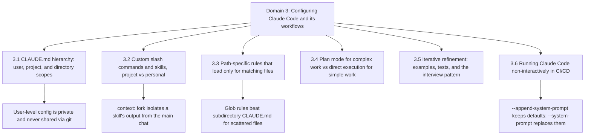

# 3 - Claude Code Configuration & Workflows

This domain is worth 20% of the exam. It is about *setting up* Claude Code so it
behaves the way your team wants — where instructions live, how you package
commands and skills, when to let Claude plan versus just execute, and how to run
Claude Code unattended inside a pipeline. The recurring theme is **scope**: who
sees a given instruction, when it loads, and how much context it costs. Most
distractors in this domain are a plausible-but-wrong scope choice.

Reported exam intel from passers (unverified calibration, not from the exam
guide) suggests this domain gets specific about [[Glossary#CLAUDE.md|CLAUDE.md]]
structure. Either way, it pays to know each config file's exact location and
audience, not just its name.

---

## 3.1 — CLAUDE.md hierarchy, scoping, and modular organization

A `CLAUDE.md` file is a memory file that Claude Code loads automatically at the
start of every session and treats as standing project context. The exam guide
frames the hierarchy as three levels by *where the file lives*:

- **User-level** (`~/.claude/CLAUDE.md`) holds your personal preferences and
  follows you across every project on your machine.
- **Project-level** (`.claude/CLAUDE.md` or a root `CLAUDE.md`) holds the
  instructions your whole team shares. It is checked into the repository.
- **Directory-level** (a `CLAUDE.md` inside a subdirectory) holds conventions
  that apply only to files under that directory.

The single most tested fact here is a scope trap: **user-level settings apply
only to you.** Anything you put in `~/.claude/CLAUDE.md` is not shared with
teammates through version control, because it never leaves your machine. If a
new teammate is not getting a rule everyone else follows, the rule is almost
certainly sitting in someone's user-level config instead of the project file.
You diagnose this by moving the rule into the project-level `CLAUDE.md`.

The course material adds a fuller picture of *where* these files load from.
The managed-policy, user, project, and local files all load together at
launch and stack — nothing gets dropped. A directory-level file is the
exception: it loads later, on demand, only when Claude reads a file under
that directory. Beyond user and project, there is a
**[[Glossary#CLAUDE.md|managed-policy]]** file that your organization's
platform team controls and you cannot exclude, and a
**[[Glossary#CLAUDE.local.md|local]]** file (`CLAUDE.local.md`) that git
ignores so you can keep private notes for one specific repository. Local is
the right home for something like architectural decisions you want Claude to
hold in mind while refactoring your own branch — useful to you, but not
something you want pushed onto the whole team.

A worked example of that local file shows the shape: a short context paragraph,
the project's setup and test commands, a "gotchas" list of known rough edges,
and a stated communication preference. It is a scratch pad for one person on one
repo, deliberately kept out of git.

Keep the file lean. `CLAUDE.md` is guidance, not enforced configuration — every
line competes with every other line for Claude's attention, so the longer the
file grows the less reliably any single rule is followed. When a rule *must*
never be broken, it does not belong in `CLAUDE.md` at all; it belongs in a
[[Glossary#Hook|hook]], which is code that actually runs (see
[[1 - Agentic Architecture & Orchestration]] for hooks as an enforcement
mechanism).

When the project file gets long, you have two ways to keep it modular:

- The **`@import` syntax** lets one file reference another (for example
  `@.claude/conventions/testing.md`). Each package's `CLAUDE.md` can pull in
  only the standards relevant to it. Be clear-eyed about what this buys you:
  imports are expanded inline at launch, so **everything still loads up front**.
  Imports organize the file; they do not reduce how much context Claude reads.
- The **[`.claude/rules/`](<Claude Commands.md#.claude/rules/>) directory**
  holds topic-specific rule files (`testing.md`, `api-conventions.md`,
  `deployment.md`) as an alternative to one monolithic `CLAUDE.md`.

Two commands support this workflow. You bootstrap a project's `CLAUDE.md` with
**[`/init`](<Claude Commands.md#/init>)**, which scans the codebase and writes
a summary of structure, dependencies, and conventions. You verify what
actually loaded with **[`/memory`](<Claude Commands.md#/memory>)**, which
lists the memory files currently in context — the tool you reach for when
behaviour is inconsistent across sessions and you suspect a file is or isn't
being picked up.

---

## 3.2 — Custom slash commands and skills

A **custom slash command** is a saved prompt you invoke by name. You create one
by dropping a Markdown file into a commands directory; the file's contents become
the prompt that runs. The command can reference `$ARGUMENTS`, which is replaced
by whatever you pass on invocation — so
[`/create_worktree feature_a`](<Claude Commands.md#/create_worktree>) runs
the command's prompt with `feature_a` substituted in.

Location decides the audience, and this is the exam's favourite distinction:

- **Project-scoped** commands live in
  [`.claude/commands/`](<Claude Commands.md#.claude/commands/>) and are
  shared with the whole team through version control.
- **User-scoped** commands live in `~/.claude/commands/` and are personal to you.

So a team's standard [`/review`](<Claude Commands.md#/review>) command
belongs in `.claude/commands/`, not in anyone's home directory and not pasted
into `CLAUDE.md` (which is for context, not command definitions).

A **skill** is a reusable, task-specific capability that Claude invokes on its
own when a task matches the skill's description. Skills live in
[`.claude/skills/`](<Claude Commands.md#.claude/skills/>) as folders, each
with a [`SKILL.md`](<Glossary.md#SKILL.md>) file. Its frontmatter supports
three options worth memorizing:

- **`context: fork`** runs the skill in an isolated subagent context so its
  output never pollutes the main conversation. Reach for this when a skill
  produces a lot of noise — a full codebase analysis, or exploratory
  brainstorming — that you don't want cluttering the main session's context.
- **`allowed-tools`** restricts which tools the skill may use while it runs. You
  narrow this to prevent destructive actions, for instance limiting a skill so
  it cannot make sweeping file writes.
- **`argument-hint`** prompts the developer for required parameters when the
  skill is invoked without them.

A skill folder can carry more than instructions. You can drop a `reference.md`
beside the skill for depth that Claude reads only when it needs it, and you can
include scripts that Claude *executes* rather than loading into context. Keep
`SKILL.md` itself lean and push the heavy material into side files.

The judgment call the exam tests is **skill versus CLAUDE.md**. A skill is
on-demand and task-specific — it fires when a particular kind of work comes up.
`CLAUDE.md` is always-loaded and universal — naming rules, where files go,
standards that apply to everything. Use a skill for a procedure tied to one kind
of task; use `CLAUDE.md` for conventions that are always in play. And when a
rule must never be skipped, use a hook, since neither of the other two is
enforced. If you want a *personal* twist on a shared skill, make a variant in
`~/.claude/skills/` under a different name so you don't affect teammates.

A common first skill to build is a **verification skill** that runs after a
refactor: it runs the test suite, reads the diff, checks that no test was
weakened just to pass, and reports pass or fail with evidence — all without you
remembering to ask.

To share a whole bundle of this configuration at once — skills, subagents,
hooks, and MCP server configs — you can package it as a **plugin**, one
versioned, installable unit added through a marketplace. Because a plugin runs
code with your privileges and its hooks fire on every matching tool call, the
rule is to read what a plugin does before installing it. See
[[2 - Tool Design & MCP Integration]] for how MCP servers are scoped and shared.

### Custom commands in practice: parallel work with worktrees

A concrete use of custom slash commands is parallelizing Claude Code. Two
sessions editing the same files collide, so each gets its own **git worktree** —
an independent working tree checked out to its own branch in its own directory.
Because the trees are separate, the sessions cannot clobber each other; when a
session exits, a clean worktree is removed automatically. A `.worktreeinclude`
file at the repo root lists git-ignored files (like a local env file) to copy
into every worktree.

The course ships this as two custom commands. A `create_worktree` command takes
a feature name as `$ARGUMENTS`, checks the worktree doesn't already exist,
creates it under `.trees/`, and wires up the environment. A
[`merge_worktree`](<Claude Commands.md#/merge_worktree>) command later merges
that branch back into main and walks through resolving any conflicts. These
are ordinary Markdown files in `.claude/commands/`, which is exactly why they
are shared with the team.

---

## 3.3 — Path-specific rules for conditional convention loading

Some conventions should apply only when you touch certain files. You express
this with a file in `.claude/rules/` whose **YAML frontmatter has a `paths`
field** listing glob patterns. The rule loads *only* when you edit a file
matching one of those patterns — for example `paths: ["terraform/**/*"]` so the
Terraform conventions appear only while editing Terraform, and `**/*.test.tsx`
so test conventions appear only while editing test files. Loading rules
conditionally keeps irrelevant context out of the window and saves tokens.

The decision the exam draws out is **path-specific rules versus a
subdirectory `CLAUDE.md`.** A directory-level `CLAUDE.md` works when the relevant
files all sit under one directory. But conventions often apply to a file *type*
scattered across the codebase — test files, for instance, live everywhere. When
the files that share a convention are spread across many directories, a
glob-pattern rule captures them all with one pattern, whereas you would need a
`CLAUDE.md` in every directory to do the same job. Spread-out files by type →
glob rule; files grouped under one directory → directory `CLAUDE.md`.

---

## 3.4 — Plan mode versus direct execution

**Plan mode** is a read-only mode: Claude researches the codebase, works out what
needs to change, and hands you a plan to review before it edits anything.
**Direct execution** just makes the change.

Match the mode to the complexity of the task:

- Use **plan mode** for complex work — large-scale changes, tasks with multiple
  valid approaches, architectural decisions, and multi-file modifications.
  Concrete triggers the guide gives include restructuring into microservices, a
  library migration touching 45+ files, and choosing between integration
  approaches with different infrastructure needs. Planning first lets you catch a
  bad approach on paper, which is far cheaper than letting Claude build the wrong
  thing and cleaning up afterward.
- Use **direct execution** for simple, well-scoped changes — a single-file bug
  fix with a clear stack trace, or adding one validation conditional to one
  function.

These are not mutually exclusive. A strong pattern is to **plan the
investigation, then execute the implementation directly**: use plan mode to
design a library migration, then switch to direct execution to carry out the
approach you settled on.

During the discovery phase, the **Explore subagent** isolates verbose output.
It goes off and does the noisy reading, then returns a summary, so the main
conversation's context isn't exhausted by raw exploration during a multi-phase
task. This is the same context-isolation idea as `context: fork` for skills and
as subagent delegation in [[5 - Context Management & Reliability]].

Plan mode is also one of Claude Code's **permission modes**, the settings that
decide once what Claude may run without asking each time. The everyday ones you
cycle with shift-tab are Manual (reads only), Accept edits (edits and safe bash
without asking), Plan (reads only, proposes changes), and Auto (runs on its own,
with a separate classifier reviewing each action for danger before it executes).
Two more exist for specific situations: **Don't ask**, which allows only
pre-approved tools and auto-denies the rest — the right choice for unattended
runs where no human can approve prompts — and **Bypass permissions**, which
skips all checks and belongs only inside an isolated container or VM. A subtle
point the course stresses: Auto's classifier guards *intent*, not
*correctness* — it won't notice that refactored code is broken, only that an
action is dangerous — so you pair Auto mode with a Stop hook that runs the tests.

---

## 3.5 — Iterative refinement techniques

When a first attempt is close but wrong, how you give feedback matters more than
how much you give. The domain names four techniques.

**Concrete input/output examples are the most effective fix when prose is
interpreted inconsistently.** If describing a transformation in words keeps
producing different results, stop describing it and show 2–3 example pairs of
input and the exact output you want. Examples pin down what prose leaves
ambiguous. (This overlaps with few-shot prompting in
[[4 - Prompt Engineering & Structured Output]].)

**Test-driven iteration** flips the order: write the test suite first — covering
expected behaviour, edge cases, and performance — then iterate by feeding Claude
the failures. Sharing a concrete failing case (say, null values breaking a
migration script) is far more actionable than saying "handle edge cases."

**The interview pattern** has Claude ask *you* questions before it implements,
surfacing considerations you hadn't thought about — cache-invalidation
strategy, failure modes — which is especially valuable in a domain you don't
know well.

Finally, decide whether to batch or sequence feedback. When problems **interact**
— fixing one affects another — put them all in a single detailed message so
Claude can reason about them together. When problems are **independent**, fix
them one at a time; sequential iteration keeps each change clean.

The broader workflow these sit inside is: feed Claude the relevant files as
context, ask it to plan without writing code, then ask it to implement. You
steer a long session with [`/compact`](<Claude Commands.md#/compact>)
(summarize and free context — always add an instruction telling it what to
keep), rewind to a checkpoint when it goes off course, and
[`/clear`](<Claude Commands.md#/clear>) to reset history between unrelated
tasks.

---

## 3.6 — Integrating Claude Code into CI/CD pipelines

Running Claude Code in a pipeline means running it **non-interactively**,
because no human is there to answer prompts. The core flag is
**[`-p`](<Claude Commands.md#-p>)** (or `--print`): it runs Claude Code as a
one-shot command with no interactive UI, reading standard in and writing
standard out so it pipes like any other shell tool. Note that `-p` also skips
auto-discovery of hooks, skills, plugins, MCP servers, and `CLAUDE.md` — you
get Claude plus the tools you allow explicitly and nothing the local
environment happens to load, which also makes startup faster.

For machine-readable results, pair
**[`--output-format json`](<Claude Commands.md#--output-format>)** with
**[`--json-schema`](<Claude Commands.md#--json-schema>)**. Claude constrains
its output to your schema and puts the matching object in the response's
`structured_output` field, which you can pull out with `jq` and post as
inline PR comments or feed to another script. When CI needs *repeatable*
output run to run, add the **[`--bare`](<Claude Commands.md#--bare>)** flag
for deterministic mode. For multi-step automation, capture the `session_id`
from the JSON output and continue later with
[`--resume`](<Claude Commands.md#--resume>).

`CLAUDE.md` still matters in CI: it is how you give the automated run project
context — testing standards, fixture conventions, review criteria — so generated
tests and reviews match your project. Documenting available fixtures and what
makes a test valuable reduces low-value output.

One reliability principle to remember: **a session should not review its own
work.** The same session that generated code carries its reasoning context and
is less likely to question its own decisions, so an *independent* review instance
catches subtle issues better. When re-running a review after new commits, include
the prior findings and tell Claude to report only new or still-unaddressed
issues, so you don't get duplicate comments. This connects to the multi-instance
review architectures in [[4 - Prompt Engineering & Structured Output]].

### Choosing a system-prompt mechanism in CI

> [!tip] 📌 Reported on the exam
> Three mechanisms that look interchangeable are not, and the exam asks you to
> pick the one whose *scope and persistence* match the requirement:
> - **[`--append-system-prompt`](<Claude Commands.md#--append-system-prompt>)**
>   appends your text to the default system prompt, so Claude Code's default
>   behaviour is **kept**. This is the right choice for temporary,
>   stage-specific instructions — different stages of a multi-step CI workflow
>   needing different roles or rules. (There is also
>   `--append-system-prompt-file` to read that text from a file.)
> - **[`--system-prompt`](<Claude Commands.md#--system-prompt>)** **replaces**
>   the system prompt entirely. Use it only when you genuinely need to
>   override the default behaviour.
> - **`CLAUDE.md`** is persistent, shared project context that applies across
>   both CI runs and ordinary interactive sessions.
>
> Temporary and additive → append. Total override → replace. Durable and shared
> → `CLAUDE.md`.
>
> *Verified against the [CLI reference](https://code.claude.com/docs/en/cli-reference) (checked 2026-09-05).*

### Managed GitHub Code Review versus the GitHub Action

For pull-request review specifically, take the **managed path**. Code Review is
an Anthropic-hosted service that reviews PRs through the Claude GitHub app; an
org admin enables it and chooses when it runs — once when a PR opens, on every
push, or only on a `@claude review` comment. It analyzes the diff against the
*full* codebase, posts findings as inline comments tagged by severity with a
summary table, and deduplicates and ranks them. Two boundaries matter: it never
approves or blocks the PR (a human decides), and there is no managed autofix. To
apply a finding you pull the change down and run
[`/code-review`](<Claude Commands.md#/code-review>) locally, whose
[`--fix`](<Claude Commands.md#--fix>) flag applies findings to your working
tree.

When the job goes *beyond* review — implementing changes from a comment, running
scheduled reports — you reach for the **GitHub Action**
(`anthropics/claude-code-action@v1`), set up with
[`/install-github-app`](<Claude Commands.md#/install-github-app>). You tune
an unattended run through `claude_args` (for example
[`--max-turns`](<Claude Commands.md#--max-turns>) to cap the
loop, a non-asking permission mode, and a minimal allowed-tools set). A cloud
alternative for recurring prompts is a **routine**, which runs on Anthropic's
infrastructure on a schedule (at most hourly) and, as a guardrail, starts from a
fresh clone of the default branch and may push only to `claude/`-prefixed
branches.

> [!tip] 📌 Reported on the exam
> Managed GitHub Code Review reads **two** files, with a division of labour, and
> the trap is assuming `CLAUDE.md` alone configures review behaviour:
> - **[`CLAUDE.md`](<Glossary.md#CLAUDE.md>)** supplies general project context
>   and standards.
> - **[`REVIEW.md`](<Glossary.md#REVIEW.md>)** at the repo root supplies
>   review-specific instructions — what to flag, severity calibration,
>   exclusions (generated code, lockfiles, vendored dependencies,
>   machine-authored branches), and reporting preferences such as capping
>   nit-level comments.
>
> *Verified against the [Code review docs](https://code.claude.com/docs/en/code-review) (checked 2026-09-05).*

---

## Traps & distractors

The wrong answers in this domain are almost all **plausible scope mistakes** —
the kind a real engineer makes. Reason about who sees a file and when it loads.

- **Putting shared team instructions in user-level `~/.claude/CLAUDE.md`.** This
  is the guide's headline diagnostic: a teammate doesn't get a rule because it
  lives in someone's user-level config, which is never shared through version
  control. Shared rules must go in the **project-level** `CLAUDE.md`. Do not be
  tempted by the answer that "just add it to CLAUDE.md" without checking *which*
  CLAUDE.md.

- **Scoping a shared slash command or skill to your user directory.** A command
  in `~/.claude/commands/` — or a skill in `~/.claude/skills/` — is personal and
  never reaches teammates through version control. A team's standard command (a
  shared `/review`, say) belongs in the project's `.claude/commands/`; user scope
  is only for a personal variant you deliberately keep to yourself. This is the
  same scope logic as the `CLAUDE.md` trap, applied to commands and skills, and
  the exam likes to hide it behind a command that "works for me but not for the
  team."

- **Choosing `--system-prompt` when `--append-system-prompt` was needed.**
  `--system-prompt` throws away Claude Code's default behaviour; if the scenario
  only needs an extra, stage-specific instruction, appending is correct and
  replacing is a bug. (See the exam-intel callout above.)

- **Assuming `CLAUDE.md` alone configures managed Code Review.** The
  review-specific knobs live in a root-level `REVIEW.md`; `CLAUDE.md` only
  carries general context. (See the exam-intel callout above.)

- **Expecting `@import` to shrink context.** Imports keep a `CLAUDE.md` tidy, but
  everything is expanded inline at launch, so the token cost is unchanged. If the
  goal is *less* context, the answer is path-specific rules that load
  conditionally, not imports.

- **Reaching for a subdirectory `CLAUDE.md` when files are scattered.** For a
  convention that applies to a file *type* spread across the codebase (all test
  files, say), a glob-pattern rule in `.claude/rules/` is correct; a per-directory
  `CLAUDE.md` would need copying into every directory.

- **Putting `CLAUDE.md` in charge of a hard rule.** `CLAUDE.md` is guidance, not
  enforcement — a rule that must never be broken belongs in a hook, which is code
  that actually runs and can block the action.

- **Using plan mode for a trivially scoped change**, or diving into direct
  execution on a 45-file migration. The mode should match complexity: plan for
  architectural, multi-approach, multi-file work; execute directly for a
  well-understood single-file fix.

- **Answering a poor result with vague feedback.** When a first attempt is close
  but wrong, telling Claude to "handle edge cases" or "be more careful" is far
  weaker than showing it what you mean. If prose keeps being read inconsistently,
  give two or three concrete input/output example pairs; if a specific case is
  failing, hand over the exact failing input — the null value that breaks the
  migration script, say — rather than a general instruction. The distractor is
  more or vaguer prose; the fix is concrete examples and a real failing case.

- **Trusting a session to review its own code.** The generating session is biased
  by its own reasoning; an independent instance catches more. Likewise, don't
  trust Auto mode's classifier to catch *broken* code — it guards intent, not
  correctness, which is why you pair it with a test-running Stop hook.

---

## Flashcards

Question
A teammate just cloned the repo but Claude Code isn't following a coding rule everyone else's sessions follow. Where is the rule most likely misplaced, and how do you fix it?
?
It is almost certainly in someone's **user-level** config (`~/.claude/CLAUDE.md`), which is personal and never shared through version control. Move the rule into the **project-level** `CLAUDE.md` (`.claude/CLAUDE.md` or root `CLAUDE.md`) so it is checked in and every teammate loads it.
#flashcards/domain-3

Question
Your CI workflow has several stages that each need Claude Code to take on a different role, but you want to keep its default behaviour intact. Which CLI mechanism fits, and why not the alternatives?
?
Use **`--append-system-prompt`**: it adds stage-specific text while keeping the default system prompt, which suits temporary, per-stage instructions. `--system-prompt` would *replace* the default entirely (only for genuine overrides), and `CLAUDE.md` is for durable shared context, not temporary per-stage roles.
#flashcards/domain-3

Question
You enabled managed GitHub Code Review and added your flagging rules and severity calibration to `CLAUDE.md`, but the review still uses default behaviour. What did you miss?
?
Managed Code Review reads review-specific instructions from a **root-level `REVIEW.md`**, not `CLAUDE.md`. `CLAUDE.md` provides only general project context; what to flag, severity levels, exclusions, and reporting preferences belong in `REVIEW.md`.
#flashcards/domain-3

Question
A convention must apply to every test file, but the test files are scattered across many directories. Do you use a subdirectory `CLAUDE.md` or a path-specific rule, and why?
?
Use a **path-specific rule** in `.claude/rules/` with a glob in its `paths` frontmatter (for example `**/*.test.tsx`). A single glob captures files by type regardless of location, whereas a subdirectory `CLAUDE.md` only covers files under one directory and would have to be duplicated everywhere. The glob rule also loads only when a matching file is edited, saving context.
#flashcards/domain-3

Question
A developer splits a long `CLAUDE.md` into several files pulled in with `@import`, hoping to cut token usage. Will it work?
?
No. `@import` keeps the file organized, but imports are expanded inline at launch, so the full content still loads and the context cost is unchanged. To actually reduce context, use path-specific rules that load conditionally, or a skill with `context: fork`.
#flashcards/domain-3

Question
A skill you wrote runs a full codebase analysis whose verbose output is flooding the main conversation. Which frontmatter option fixes this?
?
Set **`context: fork`** in the skill's `SKILL.md` frontmatter. It runs the skill in an isolated subagent context so its output never pollutes the main conversation — the right tool for verbose or exploratory skills.
#flashcards/domain-3

Question
You're deciding between plan mode and direct execution for (a) fixing one function's off-by-one bug with a clear stack trace and (b) migrating a library across 45+ files. Which goes where?
?
Direct execution for (a) — it is simple and well-scoped. Plan mode for (b) — a large, multi-file, architecture-affecting change where reviewing the approach on paper first prevents costly rework. A good combined pattern is plan mode to design the migration, then direct execution to carry it out.
#flashcards/domain-3

Question
You need Claude Code inside a CI pipeline to emit machine-parseable findings and never hang waiting for input. Which flags do you reach for?
?
Run it with **`-p`** (`--print`) for non-interactive one-shot execution so it can't hang on a prompt, and pair **`--output-format json`** with **`--json-schema`** so the result is schema-constrained and lands in the `structured_output` field for parsing (e.g. with `jq`). Add `--bare` if CI needs deterministic, repeatable output.
#flashcards/domain-3

Question
Why is it a mistake to have the same Claude Code session that generated code also review it, and what's the fix?
?
The generating session retains its own reasoning context, so it is less likely to question its own decisions and misses subtle issues. Use an **independent review instance** with no memory of how the code was built. (Auto mode's classifier is no substitute — it guards intent, not correctness.)
#flashcards/domain-3

Question
When giving Claude feedback on several problems at once, when do you batch them into one message versus fix them sequentially?
?
Batch them into a single detailed message when the problems **interact** (fixing one affects another), so Claude can reason about them together. Fix them **sequentially** when the problems are **independent**, keeping each change isolated and clean.
#flashcards/domain-3

Question
You built a handy `/review` slash command, but a teammate who pulled the repo says the command doesn't exist for them. Where did you put it, and where should it go?
?
You almost certainly saved it under **`~/.claude/commands/`**, which is user-scoped and personal — it lives only on your machine and is never shared through version control. Move the Markdown file into the project's **`.claude/commands/`** so it is checked in and every teammate gets it. User scope is only for a personal variant you don't want to push onto the team.
#flashcards/domain-3

Question
You need Claude Code to run unattended in a pipeline where no human is present to approve permission prompts, but you don't want it running with all safety checks off. Which permission mode fits, and which one would be a mistake?
?
Use **Don't ask**: it allows only the tools you pre-approved and auto-denies everything else, so nothing hangs waiting for approval and nothing unapproved runs. **Bypass permissions** would be the mistake here — it skips all checks entirely and is only appropriate inside an isolated container or VM, not a general pipeline.
#flashcards/domain-3
