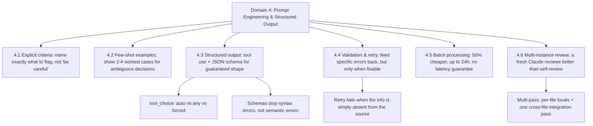

---
tags:
  - ccaf
  - domain-4
  - prompt-engineering
  - structured-output
domain: 4
---

# 4 - Prompt Engineering & Structured Output

This domain is worth 20% of the exam. It is about getting Claude to produce
output you can *trust and parse*: precise judgments with few false positives,
consistently formatted results, and machine-readable data that obeys a schema.
The questions rarely ask you to recall a definition. They give you a scenario —
an extraction pipeline that keeps inventing values, a code reviewer developers
have stopped trusting, a nightly report that costs too much — and ask which
technique actually fixes it. Study the *mechanism*, because the wrong answers are
plausible-sounding fixes that do not address the real cause.

Two facts about how the Anthropic API works underpin everything in this
domain. First, the API is stateless: it keeps no memory of a conversation, so
to hold a multi-turn exchange you must resend the whole message list with
every request. Second, [[Glossary#Temperature|temperature]] controls how random
Claude's token choices are — near 0 it is nearly deterministic and picks the
highest-probability token every time, near 1 it spreads probability across
many tokens for more varied output. Low temperature is what you reach for when
you want the same structured result every run, which matters a lot once
you're relying on that output being consistent and parseable.



## 4.1 — Write explicit criteria, not vague warnings

The core lesson is that **specific, categorical criteria beat vague
instructions**. Telling Claude to "check that comments are accurate" produces
noisy, inconsistent results. Telling it to "flag a comment only when its claimed
behavior contradicts what the code actually does" gives it a concrete test it can
apply the same way every time.

The exam's favourite trap here is the vague-reassurance instruction. Adding "be
conservative" or "only report high-confidence findings" *does not* improve
precision compared with specific categorical criteria. These phrases feel like
they should help, but they give the model nothing concrete to decide on, so the
false-positive rate barely moves.

False positives are not just noise — they destroy trust. When one category of a
reviewer produces many wrong flags, developers stop trusting the accurate
categories too. So the fix for a distrusted reviewer is not a softer instruction.
You write explicit review criteria that say which issues to report (real bugs,
security problems) and which to skip (minor style, local conventions), rather
than filtering by a confidence threshold. If one category is badly calibrated,
you can temporarily disable it to restore trust while you improve its prompt,
instead of letting it poison confidence in the rest. And when you need
consistent severity labels, you define each severity level with a concrete code
example so the classification is repeatable.

## 4.2 — Few-shot examples for consistency and judgment

When detailed instructions alone still produce inconsistent output, **few-shot
prompting is the most effective technique**. A [[Glossary#Few-shot prompt|few-shot prompt]] is one
that includes a small number of worked examples — input paired with the ideal
output — before the real task. This is the same idea as one-shot (a single
example) versus multi-shot (several); wrapping each example in
[[Glossary#XML tags|XML tags]] like `<example>` keeps its structure
unambiguous.

Examples do more than fix formatting. They teach *judgment on ambiguous cases*.
Two to four targeted examples that show the reasoning for why one action was
chosen over a plausible alternative let the model generalize that judgment to
new, unseen patterns — not just match the exact cases you listed. That
generalization is the point: you are demonstrating how to decide, not
enumerating every input.

Few-shot examples are also the antidote to two specific extraction failures.
Documents come in varied structures — inline citations versus a bibliography,
a methodology section versus details buried in prose — and showing correct
handling of each shape cuts hallucination on the shapes you demonstrated. And
they fix empty or null extraction of required fields by including examples
that pull the value correctly out of an awkward format. Good examples also
nail down the output format itself — show a finding as `location, issue,
severity, suggested fix` and the model follows that shape.

Two general prompting techniques support this task: being **clear and
direct** — lead with a plain statement of what you want, using action verbs
like "Write" or "Identify" — and being **specific**, either listing the
qualities the output should have or spelling out the steps to follow.
Examples, plus clear direction, plus XML structure, is the reliable
combination.

## 4.3 — Enforce structured output with tool use and JSON schemas

When you need output that is *guaranteed* to match a shape, the most reliable
approach is **tool use with a JSON schema**. You define a tool whose
`input_schema` describes the fields you want, and Claude fills that schema when
it "calls" the tool. Because tool use constrains the response to the schema you
declared, JSON syntax errors are eliminated entirely — no more missing commas
or stray prose around a code block. You then read the structured data straight
from the
`tool_use` block of the response. (See [[2 - Tool Design & MCP Integration]] for
how the same tool machinery is used to give agents real capabilities.)

You control whether and which tool Claude uses through [[Glossary#tool_choice|tool_choice]]:

- `auto` — Claude may call a tool or may just return text. Use it when a tool is
  optional.
- `any` — Claude must call a tool but chooses which one. This is how you
  *guarantee* structured output when several extraction schemas exist and you do
  not know the document type in advance.
- forced, written `{"type": "tool", "name": "extract_metadata"}` — Claude must
  call that one named tool. Use it to make a specific extraction run first, for
  example pulling metadata before an enrichment step.

Here's the pattern worked through concretely: define an `article_summary` tool
whose schema requires `title`, `author`, and a `key_insights` array, then call
it with a forced `tool_choice` so the extraction is guaranteed to run.
Claude's response comes back with the extracted fields inside a `tool_use`
block, which you read from `response.content[0].input`.

The critical limit to remember: **strict schemas eliminate syntax errors but not
semantic errors**. The JSON will always be well-formed, but the model can still
put line items that do not sum to the stated total, or place a value in the wrong
field. Schema validity is not correctness — semantic checks are task 4.4's job.

Two schema-design habits come up repeatedly, and both matter for the same
reason: a schema only guarantees the *shape* of the output, not that the
model is being honest about what it actually knows.

The first is making a field **optional (nullable) whenever the source
document might not contain it**. Say you're extracting `contract_end_date`
from a batch of scanned contracts. Some state the end date outright; others
only say something like "renews annually," with no fixed end date at all. If
`contract_end_date` is marked required, the model has no legal way to leave
it blank on that second kind of contract — so it fabricates a plausible-
looking date rather than violate the schema. Making the field nullable
removes that pressure: the model can return `null`, and you know to route
that document to a human instead of trusting a guess.

The second is giving open-ended categories an honest way out. If a
`document_type` field is a fixed enum — say `invoice`, `receipt`,
`purchase_order` — anything that doesn't cleanly match one of those still
gets forced into the nearest option. Add an `"other"` value with a companion
detail string, plus an `"unclear"` value for cases that are genuinely
ambiguous rather than merely uncommon. Now a shipping manifest that isn't any
of your three known types comes back as `other` with detail `"shipping
manifest"`, instead of being silently misfiled as an `invoice`.

Alongside both habits, put format-normalization rules directly in the prompt
— "dates as YYYY-MM-DD," "amounts as plain decimals with no currency
symbol" — so inconsistent source formatting gets cleaned up as the model
extracts, rather than becoming a separate pass you have to write afterward.

> A simpler, non-schema technique is worth knowing for lightweight cases:
> prefill the assistant's reply with an opening fence such as ` ```json ` and
> set a stop sequence of ` ``` `. Claude then emits only the content between
> them, with no surrounding commentary — a quick way to strip wrapper text
> without defining a tool. It gives none of tool use's schema guarantees
> though, so prefer tool use whenever the shape genuinely needs to be
> enforced.

## 4.4 — Validation, retry, and feedback loops

Structured output can be syntactically perfect and still wrong, so extraction
pipelines need a validation-and-retry layer. The main technique is
**retry-with-error-feedback**: when validation fails, send a follow-up request
containing the original document, the failed extraction, and the *specific*
validation errors, so the model can correct itself. Vague "try again" does
nothing; the named errors are what guide the fix.

The single most important judgment in this task is knowing **when a retry cannot
help**. Retries succeed for format mismatches and structural output errors —
things the model can fix by looking again at material it already has. Retries are
useless when the required information is *simply absent from the source
document*. If the answer lives only in an external document you never provided,
no amount of retrying will conjure it; you need to supply the missing source, not
loop. Recognizing "the data isn't here" versus "the data is here but formatted
wrong" is the exam-tested distinction.

Design your validation to catch semantic errors — cases where the JSON is
perfectly well-formed but the *values* in it are wrong. For an
invoice-extraction pipeline, that means having the model check its own
arithmetic: alongside the `stated_total` printed on the invoice, have it
extract a separate `calculated_total` that it computes itself by summing the
individual line items, then flag any case where the two disagree. A mismatch
means either the model misread a line item or the invoice itself contains an
error — either way, a case worth a human look rather than silent acceptance.
Where the source document contradicts itself outright (say, two different
totals printed on the same page), add a `conflict_detected` boolean so those
cases surface instead of the model quietly picking one number.

The same idea carries over to a code-review pipeline: have it record a
`detected_pattern` field on each finding, naming the specific construct that
triggered the flag (for example, "bare except clause" or "string-concatenated
SQL query"). When developers start dismissing a reviewer's findings, that
field lets you group the dismissals by pattern and see which one is
generating the false positives, so you can fix that part of the prompt
instead of guessing.

**[[Glossary#Eval workflow|Prompt evaluation]]** is the disciplined version
of this loop, and it is worth knowing by its five steps: write an initial
**prompt**; build an **eval dataset** of representative inputs; feed each
one through Claude; **grade** the outputs; then **rewrite the prompt** and
run the whole cycle again. A worked example might start with just a handful
of representative tasks to prove out the mechanics — a real production
dataset runs to thousands of cases. Testing a prompt once, or tweaking it for
a corner case or two, both leave you exposed to inputs you never considered;
running it through this loop first is what gives you confidence before
production.

A [[Glossary#Grader|grader]] scores each output, and grading comes in three
flavours, distinguished by *who or what* assigns the score:

- **Code-based grading** runs a deterministic check — parsing the output to
  confirm it is valid JSON, Python, or a regex, scoring 10 or 0. Best for
  objective, mechanical properties: output length, whether certain words
  appear, syntax validity, readability scores.
- **Model-based grading** uses a second Claude call to score an output
  against a rubric (typically 1–10). Best for response quality,
  instruction-following, and completeness — qualities a program cannot
  easily check but a good rubric can.
- **Human-based grading** asks a person to score the output, or compare two
  versions. Best for the qualities hardest to automate at all: general
  response quality, comprehensiveness, depth, conciseness, relevance.

In practice these often combine: average a code-based syntax score with a
model-based quality score into one composite grade per output, so a response
is penalized for both broken formatting and weak content. And the rewrite
step in the eval loop isn't limited to the prompt under test — the grader
itself can need tightening too. If a model grader keeps giving inconsistent
scores to outputs a human would clearly rank differently, add a
`solution_criteria` field to each eval-dataset record spelling out exactly
what a correct answer must contain, then update the model grader's own prompt
to score against those specific criteria. Sharpening the grader this way is
often what makes the rest of the loop trustworthy.

## 4.5 — Batch processing strategies

Everything so far in this domain assumes you send one request and wait for
one reply. The **Message Batches API** works differently: instead of calling
the API once per document, you submit a whole set of requests as a single
job — a hundred documents at once, say — and Claude works through them
asynchronously in the background rather than one at a time in real time. You
submit the job and poll it (or come back later) for the results, rather than
getting an answer inline.

That shift trades latency for cost. Batching gives **50% cost savings**
compared with sending the same requests synchronously, and Claude processes
the whole batch within an **up to 24-hour window** — but there is **no
guaranteed latency SLA**, so you cannot count on any single result, or the
batch as a whole, coming back quickly.

That trade-off decides where it belongs. Batch is right for **non-blocking,
latency-tolerant workloads**: overnight reports, weekly audits, nightly test
generation — work where nobody is waiting on a screen. It is **wrong for blocking
workflows** like a pre-merge check, where a developer or pipeline is stalled until
the answer comes back. The exam likes to offer "switch everything to batch for the
savings" as a tempting but wrong answer; the correct move is to keep the
synchronous API for the blocking path and use batch only for the tolerant one.

Two more facts are exam-tested. The batch API **does not support multi-turn tool
calling within a single request** — it cannot execute a tool mid-request and feed
the result back, so an agentic loop that needs tools cannot run inside one batch
request. And **`custom_id` fields correlate each request with its response**;
because results do not come back in order, the `custom_id` is how you match them
up.

Putting batch into practice comes down to a few concrete habits. Match the API
to the latency requirement — synchronous for pre-merge, batch for overnight.
Calculate
submission frequency from your SLA: with a 24-hour processing window, submitting
on 4-hour intervals keeps you inside a 30-hour SLA. When a batch partially fails,
resubmit **only** the failed documents, identified by `custom_id`, with
appropriate fixes such as chunking a document that exceeded the context limit.
And refine your prompt on a small sample set before committing a large volume, so
you maximize first-pass success and avoid paying to resubmit.

## 4.6 — Multi-instance and multi-pass review architectures

When Claude reviews its own work, it is handicapped. A model that just generated
code **retains its reasoning context from generation**, which makes it less
likely to question its own decisions in the same session. So the reliable pattern
is a **second, independent Claude instance** with no prior reasoning context —
that fresh instance catches subtle issues better than any "now review your work"
instruction or even [[Glossary#Extended thinking|extended thinking]]. This connects to the
independent-review idea in [[1 - Agentic Architecture & Orchestration]] and the
confidence-calibration workflows in [[5 - Context Management & Reliability]].

For large reviews, use a **multi-pass** structure. Split the work into per-file
local analysis passes, each focused on issues within one file, plus a separate
cross-file integration pass that examines data flow between files. Doing it all in
one pass dilutes the model's attention and produces contradictory findings; the
split keeps each pass focused. You can also run a verification pass where the
model reports a confidence score alongside each finding, so review attention can
be routed to the low-confidence ones.

## Traps & distractors

These are the wrong-but-plausible answers this domain is built to tempt you with.
Each is grounded in the official exam guide's Domain 4 tasks — either a stated
anti-pattern or a wrong answer implied by what a task's knowledge and skills
require.

- **"Be conservative" or "only report high-confidence findings."** These vague
  instructions feel like precision controls but do not improve precision compared
  with specific categorical criteria (task 4.1). If an option fixes false
  positives by softening the tone rather than naming exactly what to flag, it is
  the distractor.

- **Fixing inconsistent output by writing ever-longer instructions.** When
  detailed written instructions have already produced inconsistent formatting or
  judgment, piling on more prose rarely helps — few-shot examples are the most
  effective technique at that point (task 4.2). So an option that adds a couple
  of worked examples usually beats one that only lengthens the instructions.
  A companion trap is assuming examples only correct formatting — they also
  teach judgment on ambiguous cases and let the model generalize to novel
  patterns. So an option that says "just add one example per input type" is
  also wrong: it misses that good examples generalize rather than match cases
  one-for-one.

- **Marking a field required to "make sure it's always filled in."** When the
  source may not contain the information, a required field forces the model to
  fabricate a value to satisfy the schema (task 4.3). The correct design makes
  such fields optional/nullable.

- **Assuming a strict JSON schema guarantees a correct answer.** Schemas via tool
  use eliminate *syntax* errors, not *semantic* ones — totals that do not add up
  and values in the wrong field still get through (task 4.3). An option that
  treats "schema-valid" as "correct" is wrong.

- **Retrying when the information is absent.** Retry-with-error-feedback fixes
  format and structural errors, but retries are useless when the required data is
  simply not in the provided source (task 4.4). Looping instead of supplying the
  missing document is the trap.

- **Switching a blocking workflow to the Batch API for the cost savings.** Batch
  is 50% cheaper but has up to a 24-hour window and no latency guarantee, so it is
  wrong for pre-merge checks and other blocking work (task 4.5). Keep synchronous
  calls for anything someone is waiting on.

- **Expecting the batch API to run tools mid-request.** It does not support
  multi-turn tool calling within a single request (task 4.5), so any option that
  assumes an agentic tool loop inside one batch request is wrong.

- **Trusting a model to review its own work with a "now check yourself"
  instruction.** A model keeps its generation reasoning in the same session and
  under-questions its own decisions; a fresh independent instance is what catches
  subtle issues (task 4.6). Self-review instructions and extended thinking are the
  plausible-but-weaker distractors.

---

## Flashcards

Question
A code-review prompt produces too many false positives and developers have
started ignoring it. A teammate suggests adding "be conservative and only report
high-confidence issues." Why is this unlikely to work, and what should you do
instead?
?
Vague reassurances like "be conservative" or "only report high-confidence
findings" do not improve precision compared with specific categorical criteria —
they give the model nothing concrete to decide on. Instead, write explicit
criteria naming which issues to report (real bugs, security) versus skip (minor
style), and temporarily disable the worst-calibrated category to restore trust
while you improve its prompt.
#flashcards/domain-4

Question
Detailed written instructions still produce inconsistently formatted extraction
output across varied document structures. Which single technique most reliably
fixes this, and why does it also help on novel inputs?
?
Few-shot prompting — include 2-4 worked examples showing the ideal output for
ambiguous or varied cases. It is the most effective technique when instructions
alone fail, and because the examples demonstrate the *reasoning* for each choice,
the model generalizes that judgment to new patterns rather than only matching the
cases you listed.
#flashcards/domain-4

Question
You need output guaranteed to match a shape, and several extraction schemas exist
but you do not know the document type in advance. Which `tool_choice` setting do
you use, and what does it guarantee?
?
Use `tool_choice: "any"`. It forces Claude to call one of the tools (so you are
guaranteed structured output rather than free text) while letting it choose which
schema fits the document. Use forced `{"type": "tool", "name": "..."}` only when
you need one specific extraction to run.
#flashcards/domain-4

Question
An invoice-extraction pipeline uses a strict JSON schema via tool use, yet some
results have line items that do not add up to the stated total. Why did the
schema not catch this, and how do you detect it?
?
Strict schemas eliminate syntax errors but not semantic errors — a
schema-valid response can still contain wrong values. Detect it with a semantic
check: extract a `calculated_total` alongside the `stated_total` and flag any
discrepancy (and add a `conflict_detected` boolean for inconsistent sources).
#flashcards/domain-4

Question
An extraction keeps returning null for a required field, so an engineer marks the
field required in the schema to force a value. Why is this the wrong fix?
?
If the source document may not contain that information, marking the field
required forces the model to fabricate a value just to satisfy the schema. The
correct design makes the field optional/nullable, and you add few-shot examples
showing correct extraction from the awkward formats where the value does exist.
#flashcards/domain-4

Question
A retry loop appends validation errors and re-requests, but one class of
extraction never improves no matter how many times it retries. What is the most
likely cause, and when does retry actually work?
?
The required information is probably absent from the provided source — it exists
only in an external document you never supplied, and no retry can conjure it.
Retry-with-error-feedback works for format mismatches and structural output
errors, not for missing data. The fix is to supply the missing source, not loop.
#flashcards/domain-4

Question
A team runs Claude for both pre-merge PR checks and nightly technical-debt
reports and wants to move both to the Message Batches API for the 50% savings.
What is the right call and why?
?
Move only the nightly reports to batch. The Batch API is 50% cheaper but has an
up-to-24-hour window and no latency guarantee, which suits non-blocking overnight
work but not a pre-merge check where a pipeline is blocked waiting. Keep the
synchronous API for the blocking path.
#flashcards/domain-4

Question
You must guarantee a 30-hour SLA for a batch pipeline, and batches process within
up to 24 hours. How do you set submission frequency, and how do you handle a
batch where some documents failed?
?
Submit on a 4-hour cadence so that 4 hours of queueing plus the 24-hour window
stays inside 30 hours. When a batch partially fails, resubmit only the failed
documents — identified by their `custom_id` — with fixes such as chunking any
document that exceeded the context limit.
#flashcards/domain-4

Question
Why does asking the same Claude session that generated code to "now review your
work" catch fewer subtle bugs than an alternative, and what is the alternative?
?
The generating session retains its own reasoning context, so it is less likely to
question its own decisions. A second, independent Claude instance with no prior
reasoning context catches subtle issues better — more reliably than self-review
instructions or extended thinking.
#flashcards/domain-4

Question
A large multi-file code review produces contradictory and shallow findings when
done in one pass. What review architecture fixes this?
?
Use a multi-pass structure: run per-file local analysis passes focused on issues
within each file, then a separate cross-file integration pass for data flow
between files. Splitting the work prevents attention dilution and the
contradictory findings that a single all-at-once pass produces.
#flashcards/domain-4

Question
A classification schema forces every document into one of five fixed category
values, and the model keeps mislabeling documents that fit none of them. What
schema change fixes this without inviting a wrong guess?
?
Add an escape hatch to the enum: an `"other"` value paired with a detail string
for categories outside the fixed list, plus an `"unclear"` value for genuinely
ambiguous cases. That gives the model an honest option instead of forcing a
document into the nearest fixed category, and the detail string preserves what
the real category was so you can extend the list later.
#flashcards/domain-4

Question
A prompt-evaluation pipeline can grade outputs three ways — by code, by a
second model call, or by a human. What is each best suited for, and which
two are commonly combined into one averaged score?
?
Code-based grading runs a deterministic check (e.g. parsing output as valid
JSON/Python/regex) — best for objective, mechanical properties like syntax
validity or output length. Model-based grading uses a second Claude call
against a rubric — best for quality and instruction-following that code
cannot easily check. Human-based grading asks a person to score or
compare outputs — best for the hardest-to-automate qualities: general
quality, comprehensiveness, depth, conciseness, relevance. Code-based and
model-based scores are the two commonly averaged into one combined score.
#flashcards/domain-4

Question
You're evaluating a customer-support prompt and want to know whether Claude's
replies actually feel high-quality and appropriately concise to a real
reader — not just whether the response is well-formed. Which grader type
fits, and why would code-based grading fall short here?
?
Human-based grading — qualities like general response quality, conciseness,
and relevance are exactly what a person is best positioned to judge, and the
hardest to automate reliably. Code-based grading can only check mechanical
properties (valid syntax, output length, presence of certain words); it has
no way to assess how a response *feels* to read.
#flashcards/domain-4
