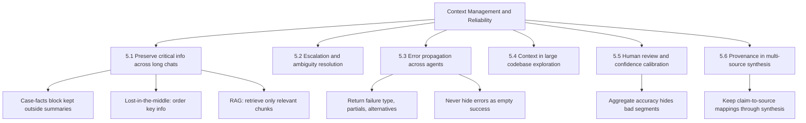

---
tags:
  - ccaf
  - domain-5
  - context-management
  - reliability
  - rag
  - escalation
  - provenance
domain: 5
weight: 15
flashcards_min: 12
---

# 5 - Context Management & Reliability

This domain is about keeping an agent trustworthy over time and across
information sources. Two things go wrong as work gets longer or more
distributed: the model loses track of details it was told earlier, and failures
in one part of the system get hidden from the parts that could recover. This
domain is 15% of the exam and pairs naturally with
[[1 - Agentic Architecture & Orchestration]] (coordinators and subagents),
[[2 - Tool Design & MCP Integration]] (structured errors) and
[[4 - Prompt Engineering & Structured Output]] (confidence and review).

The exam frames this domain as "making sound escalation and reliability
decisions, including error handling and human-in-the-loop." Study it around the
six tasks below, not around the RAG notebooks — the notebooks supply the
mechanics for
[[#5.1 Preserve critical information across long interactions|5.1]] and
[[#5.4 Manage context in large codebase exploration|5.4]], but the exam tests
judgment about escalation, error propagation, review, and provenance.

---

## 5.1 Preserve critical information across long interactions

The core problem: as a conversation grows, the exact facts that matter get
buried, dropped, or blurred. Three failure modes show up on the exam.

**Progressive summarization destroys precision.** When you compress earlier
turns into a summary to save room, you tend to turn hard facts into soft ones.
A refund of `$47.03` becomes "a small refund," an order date becomes "recently,"
and a customer's stated expectation ("I was promised a replacement by Friday")
becomes "the customer is unhappy." [[Glossary#Progressive summarization|Progressive summarization]] is
useful for narrative context but dangerous for numbers, percentages, dates, and
customer-stated commitments.

**The "lost in the middle" effect.** Models reliably use information at the
*beginning* and *end* of a long input, but they may skip findings buried in the
middle. So the fix is not just "include everything" — it is *where* you put
things. Place a key-findings summary at the top, and organize the details under
explicit section headers so nothing important lives only in the murky middle.
[[Glossary#Lost in the middle|Lost in the middle]] is a positional effect, not a token-limit
effect.

**Tool results pile up out of proportion to their value.** An order lookup might
return 40+ fields when only 5 are relevant to a return. Left alone, every such
result accumulates in context and crowds out room for reasoning. Trim verbose
tool outputs down to the fields you actually need *before* they land in the
conversation.

The recommended pattern is a persistent **"case facts" block**: extract the
transactional facts — amounts, dates, order numbers, statuses — into a
structured block that you include in *every* prompt, kept outside the
summarized history. For sessions juggling several issues at once, give each
issue its own structured entry in a separate context layer. And when a subagent
feeds a downstream agent that has a small context budget, have the upstream
agent return structured data (key facts, citations, relevance scores) instead of
verbose prose and reasoning chains.

> [!tip] 📌 Reported on the exam
> Several passers said they had never heard of a **rolling window context**
> before the exam, and it surprised them. The distinction it tests: on the API,
> context **accumulates** — every user message, assistant response, tool result,
> image, document, tool definition, and even extended-thinking output is
> preserved completely and nothing is dropped for you. Chat interfaces like
> claude.ai *can* manage the window on a rolling **first-in, first-out** basis,
> dropping the oldest turns. So if you build on the API, no rolling window
> happens unless you implement one; long conversations need an explicit strategy
> (server-side compaction or context editing) or you hit the limit. Exceeding
> the window on input alone returns a 400 `invalid_request_error`; on 4.5-class
> models, running out mid-generation stops with
> `stop_reason: "model_context_window_exceeded"`. Verified against the
> [Context windows doc](https://platform.claude.com/docs/en/build-with-claude/context-windows).

### RAG: managing context by retrieving only what you need

[[Glossary#Retrieval Augmented Generation (RAG)|Retrieval Augmented Generation]] (RAG) is the main mechanical answer
to "the document is bigger than the prompt." Instead of stuffing an 800-page
report into one prompt — which hits length limits, costs more, runs slower, and
makes the model less effective — you chunk the document ahead of time and, at
question time, retrieve only the chunks relevant to the question. RAG trades
simplicity for scalability and efficiency.

**Chunking** splits the document into pieces. There is no single best strategy,
so match it to your content:

- Size-based chunking cuts the text into equal-length pieces. It is the most
  reliable fallback and works with any content including code, but it cuts words
  and sentences apart. Adding overlap between chunks restores some lost context.
- Structure-based chunking splits on the document's own structure — Markdown
  headers, sections, paragraphs. It gives the cleanest chunks but only works
  when you can trust the document's formatting.
- Sentence-based chunking groups a few sentences per chunk with optional
  overlap. It is a practical middle ground for most prose.
- Semantic chunking groups sentences by how related they are in meaning. It is
  the most accurate and the most computationally expensive.

**Embeddings and semantic search** find relevant chunks by meaning rather than
exact words. An [[Glossary#Embedding|embedding]] is a list of numbers representing the
meaning of a piece of text; each number is a learned feature we cannot directly
interpret. You embed every chunk, store the vectors in a
[[Glossary#Vector database|vector database]], then embed the user's question and ask the
database for the closest chunks. Closeness is measured by
[[Glossary#Cosine similarity|cosine similarity]] — the cosine of the angle between two vectors,
ranging from **-1** (opposite) to **1** (nearly identical); cosine *distance* is simply
`1 - similarity`.

Semantic search alone misses exact strings. If a user searches for an incident
ID like `INC-2023-Q4-011`, semantic search may return conceptually related
sections that never contain the literal ID. [[Glossary#BM25|BM25]] is a lexical
(keyword) search that weights rare, specific terms highly and ignores common
words, so it nails exact matches for IDs, error codes, and technical terms. A
hybrid pipeline runs semantic and BM25 search in parallel and merges their
rankings with [[Glossary#Reciprocal rank fusion (RRF)|reciprocal rank fusion]] (RRF), which combines each
chunk's rank from both lists using `score = Σ 1 / (k + rank)`.

Two further accuracy techniques from the courses:

- **LLM-based re-ranking** passes the merged candidate chunks back to Claude and
  asks it to reorder them by relevance. Accuracy improves, but latency goes up.
- **Contextual retrieval** fixes the fact that an isolated chunk forgets where
  it came from. Before indexing, you send each chunk plus (a reduced view of)
  the source document to Claude and ask it to write a short snippet situating
  the chunk in the whole — for example, noting that a software section mentions
  an incident that also appears in the cybersecurity section. You index that
  contextualized chunk. It helps most when sections reference each other or
  concepts are defined elsewhere.

### Prompt caching for repeated context

[[Glossary#Prompt caching|Prompt caching]] reuses the preprocessing work Claude does on content
you send repeatedly, which lowers cost and latency when the same large block
appears again and again (document Q&A, iterative editing). Caching is not
automatic: you place a cache breakpoint (`cache_control: {"type": "ephemeral"}`)
on a block, and everything up to and including that breakpoint is cached. The
follow-up request only reads the cache if the content is *identical* up to the
breakpoint — even adding the word "please" invalidates it. Claude processes
components in a fixed order (tools, then system prompt, then messages), you can
set up to four breakpoints, cached content must be at least 1024 tokens, and the
cache lives for one hour. System prompts and tool definitions are ideal to cache
because they rarely change.

---

## 5.2 Escalation and ambiguity resolution

An agent has to know when to hand off to a human and when to keep working. The
exam tests the *triggers*, and it deliberately offers plausible-but-wrong ones.

The **appropriate** escalation triggers are:

- The customer explicitly asks for a human. Honor this immediately — do not run
  an investigation first.
- The policy has a gap or an exception applies. Escalate when policy is
  ambiguous or simply silent on the specific request. For example, if policy
  covers only own-site price adjustments and the customer asks about matching a
  competitor's price, the policy does not address it, so escalate.
- The agent cannot make meaningful progress.

Note the second point: escalate on a policy *gap*, not merely because a case is
*complex*. Complexity alone is not a reason to escalate.

There is a real difference between escalating and offering to resolve. If a
customer explicitly demands a human, escalate right away. If the issue is
straightforward and within your capability, acknowledge any frustration and
offer to resolve it — escalate only if the customer reiterates that they want a
person.

When a tool returns **multiple matches** — say two customers with the same name
— ask for an additional identifier. Do not pick one heuristically; guessing
risks acting on the wrong account.

The way you build these behaviors in is through explicit escalation criteria in
the system prompt, backed by [[4 - Prompt Engineering & Structured Output|few-shot examples]]
that show when to escalate versus resolve.

---

## 5.3 Error propagation across multi-agent systems

In a [[1 - Agentic Architecture & Orchestration|coordinator-subagent system]], a
subagent that hits an error is not the one that decides what to do next — the
coordinator is. So a subagent's job is to report failure in a way the
coordinator can *act on*.

Return **structured error context**: the failure type, what query or action was
attempted, any partial results already gathered, and possible alternative
approaches. That lets the coordinator make an intelligent recovery decision —
retry, route around the failure, or proceed with partial coverage.

Distinguish two things that look similar but mean opposite things:

- An **access failure** — a timeout or an unavailable service — means the answer
  is unknown and the coordinator may need to retry or try another route.
- A **valid empty result** — a successful query that simply found no matches —
  means the answer is "there is nothing" and retrying is pointless.

Collapsing these together is how systems waste retries or, worse, treat a
genuine failure as "no data found."

Subagents should also do **local recovery**: handle transient failures
themselves (a quick retry on a timeout) and only propagate the errors they
genuinely cannot resolve, still including what they attempted and any partial
results. And when a synthesis agent writes its output, it should include
**coverage annotations** — marking which findings are well-supported and which
topics have gaps because a source was unavailable — so the gap is visible rather
than silently absent.

This task shares its vocabulary with [[2 - Tool Design & MCP Integration#Task 2.2 — Structured error responses for MCP tools|MCP structured errors]] (the `isError`
flag, `errorCategory`, and `isRetryable`): the tool layer and the agent layer
must both refuse to flatten distinct failures into one generic status.

---

## 5.4 Manage context in large codebase exploration

Long exploration sessions degrade in a specific, recognizable way:
[[Glossary#Context degradation|context degradation]] shows up as the model giving inconsistent
answers and starting to reference "typical patterns" instead of the specific
classes and files it actually discovered earlier in the session. When you see
generic hand-waving replace concrete references, context has rotted.

The countermeasures, from most to least aggressive:

- **Scratchpad files.** Have the agent write key findings to a
  [[Glossary#Scratchpad|scratchpad]] file and refer back to it for later questions. This
  persists facts across context boundaries so they survive even when the
  conversation itself is trimmed.
- **Subagent delegation.** Spawn a subagent to answer a specific question —
  "find all test files," "trace the refund flow's dependencies" — so the verbose
  discovery output stays in the subagent and the main agent keeps only the
  high-level coordination. Summarize the findings of one phase before spawning
  subagents for the next, and inject those summaries into the new context.
- **[`/compact`](<Claude Commands.md#/compact>).** In [[3 - Claude Code Configuration & Workflows|Claude Code]], `/compact` summarizes the conversation, uses the summary as the new context, and drops the old messages. Always steer it — write instructions after the command (e.g. `/compact focus on the refund-flow classes`) so the summary keeps what matters. Left unsteered, `/compact` may drop the one detail you needed and let the agent drift.
  A rule or invariant that lives *only* in the conversation — a validation rule
  you stated mid-session, say, and never wrote to disk — does not survive
  `/compact` at all: the summarizer produces prose from the transcript and
  does not selectively preserve instructions. What *does* survive is whatever
  reloads from disk afterward — project-root
  [[Glossary#CLAUDE.md|CLAUDE.md]] is re-read and re-injected right after
  compaction, and nested CLAUDE.md files or path-scoped `.claude/rules/`
  reload as Claude next reads a matching file — so a rule that lives only in
  the conversation is the one thing compaction has no way to bring back. A
  [[Glossary#SessionStart|SessionStart]] hook with the `compact` matcher is
  the scripted version of the same idea: it fires right after compaction and
  can print a summary that goes straight back into context, which is how you
  automate "pick up where you left off" instead of relying on CLAUDE.md alone
  (see [[1 - Agentic Architecture & Orchestration#1.5 Apply Agent SDK hooks for tool call interception and data normalization|1.5]]).
  If a discovery made mid-session (a shared mutex some code depends on,
  a validation rule a pipeline must keep enforcing) needs to survive
  compaction — or simply needs to stop decaying in the "lost in the middle" of
  a long transcript — promote it out of the conversation and into
  [[3 - Claude Code Configuration & Workflows|CLAUDE.md]] (or the case-facts
  block, for a non-Claude-Code agent), so it reloads at full strength on every
  future turn instead of being re-derived from a fading summary.
- **Structured state for crash recovery.** For long multi-agent runs, have each
  agent export its state to a known location and have the coordinator load a
  manifest on resume and inject it back into agent prompts. That way a crash
  does not mean starting the exploration over.

---

## 5.5 Human review workflows and confidence calibration

The central warning: a good-looking overall accuracy number can hide a
subgroup where the system is doing badly. A pipeline reporting 97% accuracy
across all documents may be nearly perfect on common document types and
quietly terrible on a rare one — the many easy cases mathematically outweigh
the few bad ones, so the single headline number never reveals the problem.
Before you reduce human review, break accuracy down *by document type and by
field* and confirm performance holds up in each of those breakdowns
individually — do not trust the headline number alone.

To keep measuring once a system is live, use **stratified random sampling**:
sample from the high-confidence extractions specifically, so you keep measuring
their true error rate and can catch novel error patterns that emerge over time.
[[Glossary#Stratified random sampling|Stratified random sampling]] deliberately samples within subgroups
(here, the confidence bands) rather than uniformly across the whole population.

Route reviewer attention with **field-level confidence scores**. Have the model
output a confidence score per field, then calibrate the review thresholds using a
labeled validation set — real labels tell you what a given confidence level
actually means. Send the low-confidence extractions, and any drawn from
ambiguous or contradictory source documents, to human review, so limited
reviewer capacity goes where it is most needed.

This task is the reliability counterpart to [[4 - Prompt Engineering & Structured Output|multi-instance and multi-pass review]]:
that earlier task is about designing the review pipeline itself — running
several passes or instances to produce a well-checked output. This task picks
up after that pipeline runs, deciding which of its outputs a human reviewer
should actually spend time on.

---

## 5.6 Preserve provenance in multi-source synthesis

[[Glossary#Provenance|Provenance]] means knowing which source each claim came from.
Synthesis is where it gets lost: when a summarization step compresses findings
without carrying the claim-to-source mapping along, the final report states facts
with no way to trace them back.

The fix is to make the mapping a first-class, structured object. Require each
subagent to output structured **claim-source mappings** — the source URL or
document name, and the relevant excerpt — for every claim, and require the
synthesis agent to *preserve and merge* those mappings rather than flattening
them into prose.

Handle disagreement honestly. When two credible sources report conflicting
statistics, annotate the conflict with each source's attribution instead of
arbitrarily picking one value. A good pattern is to complete document analysis
with the conflicting values *included and labeled*, and let the coordinator
decide how to reconcile them before synthesis. Structure the final report so it
distinguishes well-established findings from contested ones, preserving each
source's original characterization and methodological context.

Watch for **temporal traps**: two sources can look contradictory only because
they were published or collected at different times. Require publication or
collection dates in structured outputs so a time difference is read as a time
difference, not a contradiction.

Finally, render each content type in its natural form in the synthesis output —
financial data as tables, news as prose, technical findings as structured lists
— rather than forcing everything into one uniform format that obscures meaning.

---

## Traps & distractors

These are the wrong-but-plausible answers this domain invites. Each is grounded
in the official exam guide — either a stated anti-pattern or a wrong answer
implied by a task's knowledge and skills — or a doc-verified exam-intel entry,
never in any mock question.

- **Escalating on customer sentiment or the model's self-reported confidence.**
  An angry tone or a low self-reported confidence score feels like a signal to
  escalate, but the guide names both as *unreliable proxies* for actual case
  complexity. Escalate on real triggers — an explicit request for a human, a
  policy gap, or an inability to make progress.

- **Picking one match heuristically when a lookup returns several.** Choosing the
  "most likely" customer among multiple matches risks acting on the wrong
  account. Ask for an additional identifier instead.

- **Returning a generic error like "search unavailable."** A uniform, contextless
  error hides from the coordinator everything it needs to recover — the failure
  type, what was attempted, and any partial results. Return structured error
  context instead.

- **Silently suppressing errors as empty success, or killing the whole workflow
  on one failure.** Reporting a failed query as "no results" makes a real failure
  invisible; aborting the entire run on a single subagent failure throws away
  everything else. Both are named anti-patterns. Recover locally, propagate what
  you cannot resolve, and annotate coverage gaps.

- **Trusting a 97% aggregate accuracy number.** A high overall score can mask
  poor performance on a specific document type or field. Validate accuracy by
  segment before reducing human review.

- **Pushing through a degrading exploration session instead of managing its
  context.** When a long codebase session starts giving inconsistent answers and
  falling back on "typical patterns" rather than the specific classes it found,
  the wrong move is to keep asking questions and hope it recovers. That is
  context degradation, and it does not fix itself. Persist findings to a
  scratchpad file, delegate verbose discovery to a subagent, or run a steered
  `/compact` (with instructions naming what to keep) to reclaim room — do not
  rely on an unsteered `/compact`, which can drop the one detail you needed.

- **Summarizing away the numbers.** Progressive summarization that folds exact
  amounts, percentages, dates, and customer-stated expectations into vague prose
  is a trap; keep those in a persistent case-facts block outside the summary.

- **Arbitrarily choosing one value when sources conflict, or flattening
  everything to a uniform format.** Annotate conflicts with source attribution
  and dates rather than silently picking a winner, and render each content type
  in its natural form.

- **Trusting a mid-session discovery or conversation-only rule to survive
  `/compact` (or a long transcript) on its own.** Neither a fading summary nor
  a "remember this" instruction that was never written to disk persists
  reliably. A finding or rule that must hold for the rest of the session
  belongs in CLAUDE.md or a persistent facts block, not the transcript.

- **Assuming the API rolls off old turns for you.** On the API context
  accumulates and nothing is dropped automatically; only chat interfaces roll
  first-in-first-out. Long API conversations need an explicit compaction or
  context-editing strategy.

- **Raising `max_tokens` to fix a context problem.** `max_tokens` caps how much
  Claude may generate in *this one reply*; it has no effect on how much
  conversation history, tool output, or prior context fits in the request. A
  session losing earlier details or running out of room needs the techniques in
  this domain — a persistent facts block, trimmed tool outputs, a steered
  `/compact` — not a bigger `max_tokens`. See [[Glossary#max_tokens|max_tokens]].

---

## Flashcards

Question
A customer-service agent summarizes each turn to save context. After several
turns it tells a customer their refund is "processing soon" but has lost the
exact amount and the promised date. What is the underlying failure, and the fix?
?
The failure is progressive summarization condensing precise facts (amount, date,
customer-stated expectation) into vague prose. The fix is a persistent
"case facts" block holding the transactional facts — amounts, dates, order
numbers, statuses — included in every prompt and kept outside the summarized
history.
#flashcards/domain-5

Question
You feed a long aggregated document to Claude and it consistently omits findings
that sit in the middle sections. What effect is this, and how do you mitigate it
without just adding more tokens?
?
This is the "lost in the middle" effect: models use information at the beginning
and end of long inputs more reliably than the middle. Mitigate it by ordering,
not volume — put a key-findings summary at the top and organize details under
explicit section headers so nothing critical lives only in the middle.
#flashcards/domain-5

Question
An angry customer's messages trip a sentiment threshold and the agent escalates,
even though the request (a standard return) is well within policy. Why is
sentiment the wrong escalation trigger, and what triggers are appropriate?
?
Sentiment (like self-reported confidence) is an unreliable proxy for actual case
complexity. Appropriate triggers are an explicit customer request for a human, a
policy gap or exception (not mere complexity), and inability to make meaningful
progress. Here you should acknowledge the frustration and offer to resolve,
escalating only if the customer reiterates they want a person.
#flashcards/domain-5

Question
A customer asks whether you'll match a competitor's lower price. Your policy only
describes adjustments for your own site's prices. Resolve or escalate, and why?
?
Escalate. The policy is silent on this specific request, which is a policy gap —
an appropriate escalation trigger. You escalate because policy does not cover it,
not because the case is complex.
#flashcards/domain-5

Question
A search subagent times out and returns `{"status": "search unavailable"}` to the
coordinator. Why is this a poor design, and what should it return instead?
?
A generic status hides the context the coordinator needs to recover. Return
structured error context: the failure type, what was attempted, any partial
results, and possible alternatives — and distinguish this access failure (retry
may help) from a valid empty result (a successful query with no matches, where
retry is pointless).
#flashcards/domain-5

Question
One of five research subagents fails. The system returns empty results as if the
query succeeded and finishes the whole workflow. Name the two anti-patterns.
?
First, silently suppressing an error by returning empty results as success, which
makes a real failure invisible. Second, terminating the entire workflow on a
single failure, which discards the other subagents' good work. The right approach
is local recovery for transient errors, propagating only unresolvable ones with
what was attempted, and annotating coverage gaps in the synthesis.
#flashcards/domain-5

Question
During a long codebase exploration, Claude starts describing "typical" patterns
instead of the specific classes it found earlier. What is happening and what are
two ways to counteract it?
?
This is context degradation in an extended session. Counteract it with scratchpad
files that persist key findings across context boundaries, subagent delegation to
isolate verbose discovery, and steered `/compact` to summarize and reclaim room
(with instructions telling it what to keep).
#flashcards/domain-5

Question
An extraction pipeline reports 97% overall accuracy, so a team proposes dropping
human review. Why is the aggregate misleading, and what should they check first?
?
An aggregate number can mask poor performance on a specific document type or
field. Before reducing review, analyze accuracy by document type and field
segment, use stratified random sampling of high-confidence extractions to keep
measuring error rates and catch novel patterns, and route low-confidence or
contradictory-source extractions to humans.
#flashcards/domain-5

Question
Two credible sources in a research synthesis report different figures for the
same metric. What should the synthesis agent do?
?
Annotate the conflict with each value's source attribution rather than arbitrarily
picking one, and check whether differing publication or collection dates explain
the gap so a time difference is not misread as a contradiction. Preserve the
claim-source mappings through synthesis and separate well-established findings
from contested ones.
#flashcards/domain-5

Question
A user searching a large report for the exact incident ID `INC-2023-Q4-011` gets
back semantically related sections that never contain the ID. Which retrieval
technique fixes this and why?
?
BM25 lexical search. It weights rare, specific terms highly and matches exact
strings, so it finds IDs, error codes, and technical terms that semantic search
alone can miss. A hybrid pipeline runs semantic and BM25 in parallel and merges
their rankings with reciprocal rank fusion.
#flashcards/domain-5

Question
You are building a long-running assistant on the Claude API and assume old turns
drop off automatically once the conversation gets long. Why is that wrong?
?
On the API, context accumulates and previous turns are preserved completely —
nothing is dropped for you. Only chat interfaces (like claude.ai) can roll the
window first-in-first-out. On the API you must implement an explicit strategy
(server-side compaction or context editing) or you will hit the limit.
#flashcards/domain-5

Question
A search subagent hands its results to a downstream synthesis subagent that has
a small context budget. Right now it passes along its full verbose reasoning
chain and raw tool output. What should the upstream agent return instead, and
why does it matter here?
?
Have the upstream agent return structured data — key facts, citations, and
relevance scores — rather than verbose prose and reasoning. When the downstream
agent has a limited context budget, verbose upstream output crowds out room for
its own work, so passing only the distilled, structured facts (with attribution
preserved) keeps the synthesis agent both informed and within budget.
#flashcards/domain-5

Question
A long-running session keeps losing track of details from earlier in the
conversation, so a teammate suggests raising `max_tokens` to give Claude "more
room." Will that fix it?
?
No. `max_tokens` only caps how much Claude can generate in its *next* reply —
it has no effect on how much conversation history or tool output the request
carries. A session losing earlier details is a context-window problem, fixed
with this domain's techniques (a persistent facts block, trimmed tool outputs,
a steered `/compact`), not a bigger `max_tokens`.
#flashcards/domain-5
